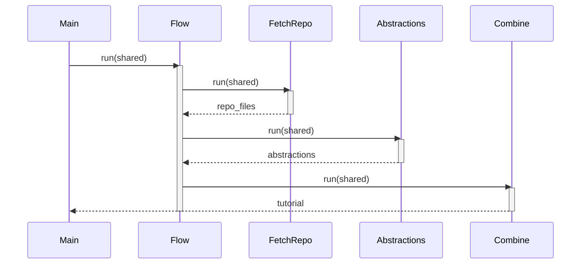

# Chapter 1: Flow

Imagine you're directing a movie. You have actors, a script, cameras, and a whole crew. But without a director, everything would be chaotic! The director ensures that each scene is filmed in the right order, that the actors know their lines, and that all the pieces come together to create a great film.

In our tutorial generation project, the **Flow** is like that director. It orchestrates the entire process of taking a codebase and turning it into a step-by-step tutorial. Without the Flow, we'd just have a bunch of individual tasks, like fetching code and writing text, but no way to connect them or ensure they happen in the right order.

This chapter will explain how the Flow works, why it's essential, and how it helps us create awesome tutorials.

## The Problem: Codebase to Tutorial Chaos

Let's say we want to create a tutorial for a simple calculator app on GitHub. We need to:

1.  Download the code.
2.  Figure out the key parts (abstractions) of the code, like the `add` function.
3.  Understand how these parts relate to each other.
4.  Decide on the right order to explain these concepts in the tutorial.
5.  Write the actual tutorial chapters.
6.  Combine the chapters into a final document.

Trying to do all of this manually would be a nightmare. What if we write a chapter about a function before we've even downloaded the code? What if we forget to explain a crucial part? The Flow makes sure none of this happens.

## Key Concepts: The Conductor of Codebase Tutorials

Think of the Flow as a conductor leading an orchestra. It has a score (the tutorial generation process) and makes sure each instrument (each step in the process) plays its part at the right time.

Here are the key aspects of the Flow:

*   **Nodes:** These are the individual tasks in our tutorial generation process, like "Fetch the Repository," "Identify Key Abstractions," or "Write Chapters." We will talk about [Node](04_node.md) in Chapter 4.

*   **Sequence:** The Flow defines the order in which the nodes are executed. This ensures that, for example, we don't try to analyze the code *before* we've downloaded it.

*   **Data Transfer:** Nodes often need to share information with each other. For instance, the "Fetch the Repository" node downloads the code, and the "Identify Key Abstractions" node needs to access that code. The Flow manages this transfer of data.

## Using the Flow: From Code to Tutorial

Let's look at how a Flow is defined in our project, step-by-step:

First, we import all the parts our 'orchestra' will be made of, specifically our `Flow` and the task `Nodes`:

```python
from pocketflow import Flow
# Import all node classes from nodes.py
from nodes import (
    FetchRepo,
    IdentifyAbstractions,
    AnalyzeRelationships,
    OrderChapters,
    WriteChapters,
    CombineTutorial
)
```

Explanation:
- `from pocketflow import Flow`: This line imports the `Flow` class from a library called `pocketflow`. The `Flow` is what we use to define the sequence of steps in our tutorial generation process.
- `from nodes import ...`: This imports various `Node` classes (like `FetchRepo`, `IdentifyAbstractions`, etc.) from a `nodes.py` file. Each `Node` represents a specific task, such as fetching a repository or identifying important concepts in the code. We will dive deep into `Node` in [Node](04_node.md).
- `from nodes import ...`: You might be wondering where these `Node` files come from. They are specific files like `fetch_repo.py`, `identify_abstractions.py`, etc. But the `nodes.py` is just a Python file that imports ALL of them at once so we don't have to `import fetch_repo`

Next, we create all the actors ("Nodes") that will make up the process of creating a tutorial:

```python
def create_tutorial_flow():
    # Instantiate nodes
    fetch_repo = FetchRepo()
    identify_abstractions = IdentifyAbstractions(max_retries=3, wait=10)
    analyze_relationships = AnalyzeRelationships(max_retries=3, wait=10)
    order_chapters = OrderChapters(max_retries=3, wait=10)
    write_chapters = WriteChapters(max_retries=3, wait=10) # This is a BatchNode
    combine_tutorial = CombineTutorial()
```
Explanation:
- These lines instantiate (create an instance of) each of the `Node` classes we imported earlier.
-  For example, `fetch_repo = FetchRepo()` creates an object named `fetch_repo` from the `FetchRepo` class. This `fetch_repo` object will be responsible for fetching the code repository. If you look closely you can see `identify_abstractions = IdentifyAbstractions(max_retries=3, wait=10)`, and although we haven't yet dived into `Node`, it means `identify_abstractions` is allowed to retry 3 times with a 10 second wait interval.
- `write_chapters = WriteChapters(max_retries=3, wait=10)` is a special node called `BatchNode`, compared to typical Nodes. The key difference is that Batch nodes can be run for many parts of the code at once (`Batch`), whereas other nodes are ran once in the Flow.

Then, we connect the `Nodes` in the right order, like putting together the parts of our automated tutorial factory line:
```python
    # Connect nodes in sequence based on the design
    fetch_repo >> identify_abstractions
    identify_abstractions >> analyze_relationships
    analyze_relationships >> order_chapters
    order_chapters >> write_chapters
    write_chapters >> combine_tutorial
```

Explanation:
- `fetch_repo >> identify_abstractions`: This line uses the `>>` operator (defined within the Flow library) to specify that the `identify_abstractions` node should run *after* the `fetch_repo` node has completed its task.
- This creates a direct sequence such that the output of `fetch_repo` which contains the code repository will be inputted to `identify_abstractions`.
- The order must be valid as it defines our factory line! We shouldn't begin extracting information until we `fetch_repo` first.

Finally, we create the Flow using all the nodes and connections we just defined:
```python
    # Create the flow starting with FetchRepo
    tutorial_flow = Flow(start=fetch_repo)

    return tutorial_flow
```

Explanation:
- `tutorial_flow = Flow(start=fetch_repo)`: This creates an instance of the `Flow` class which is saved under the name `tutorial_flow`. We pass in the very first node, `fetch_repo`, to the `Flow`'s constructor so it understands where the automation process begins.
- `return tutorial_flow`:  This returns the `tutorial_flow` object, which contains all the information about the tasks that need to be done and the order in which they should be executed.

Now, let's see how this Flow is used in the `main.py` file:

```python
# Import the function that creates the flow
from flow import create_tutorial_flow

# ... some code omitted for brevity ...

    # Create the flow instance
    tutorial_flow = create_tutorial_flow()

    # Run the flow
    tutorial_flow.run(shared)
```

Explanation:
- A new flow is initializated using `create_tutorial_flow()` which contains all the initial setups of the tutorial pipelines.
- `tutorial_flow.run(shared)`: This line *starts* the Flow. The `shared` dictionary contains all the initial information needed to jumpstart the factory, such as the URL of the repository we want to turn into a tutorial. As the `Nodes` do their work, they fill in this shared dictionary. We will dive deeper into [Shared Dictionary](06_shared_dictionary.md) in Chapter 6.

So, imagine we provide the URL to a simple "Hello, world!" Python program on GitHub. The Flow would:

1.  Download the code using the `FetchRepo` node, and stores the files in a *shared dictionary* that all the nodes can access.
2.  The `IdentifyAbstractions` node then looks at the code and identifies the key parts, such as the main function and any important variables.
3.  The `AnalyzeRelationships` node figures out how these parts relate to each other (e.g., the main function calls another function).
4.  The `OrderChapters` node decides on the best order to explain these concepts in the tutorial (e.g., start with the basics and then move on to more complex topics).
5.  The `WriteChapters` node, for each important file in our "Hello, world!" program, writes a chapter that explains what the code does.
6.  Finally, the `CombineTutorial` node puts all the chapters together into a single, well-formatted tutorial of our codebase.

## Under the Hood: How the Flow Works

Let's take a peek under the hood to understand how the Flow orchestrates these steps. Here's a simplified view of what happens when you call `tutorial_flow.run(shared)`:



1.  The `main.py` script calls the `run()` method of the `Flow` object, passing in the `shared` dictionary.
2.  The `Flow` object calls the `run()` method of the first node in the sequence (in this case, `FetchRepo`), again passing in the `shared` dictionary.
3.  The `FetchRepo` node does its work (downloads the repository and reads the file contents).
4.  Once `FetchRepo` is done, it updates the `shared` dictionary with the downloaded code, so it can be passed on to the next node.
5.  The `Flow` object then calls the `run()` method of the next node (e.g., `IdentifyAbstractions`), and the process repeats.
6.  This continues until all nodes have been executed, and the final output (the generated tutorial) is produced by the last node (`CombineTutorial`).
7.  The tutorial is written to a file and the `main.py` file ends with a created tutorial.

The `Flow` makes sure that each node is executed in the correct order and that the data produced by each node is passed to the next node in the sequence.

## Why is this important for reproducibility and complex transformations?

The `Flow` ensures that the tutorial generation process is:

*   **Reproducible:** Given the same codebase and configuration, the Flow will always produce the same tutorial.
*   **Maintainable:** As the tutorial generation process becomes more complex, the Flow helps us keep everything organized and makes it easier to add new steps or modify existing ones.
*   **Scalable:** The modular nature of the Flow allows us to easily scale up the tutorial generation process to handle larger and more complex codebases.

## Conclusion

In this chapter, we've learned about the Flow, the central orchestration mechanism in our tutorial generation project. We've seen how it solves the problem of turning a codebase into a tutorial by defining the sequence of steps, managing data transfer, and ensuring that each step is executed in the correct order.

In the next chapter, we'll explore the [Configuration and Defaults](02_configuration_and_defaults.md) of our project, where we specify the settings like the GitHub repository to use, and the include/exclude file patterns. These configurations serve as instructions for the Flow.


---

Generated by [AI Codebase Knowledge Builder](https://github.com/The-Pocket/Tutorial-Codebase-Knowledge)