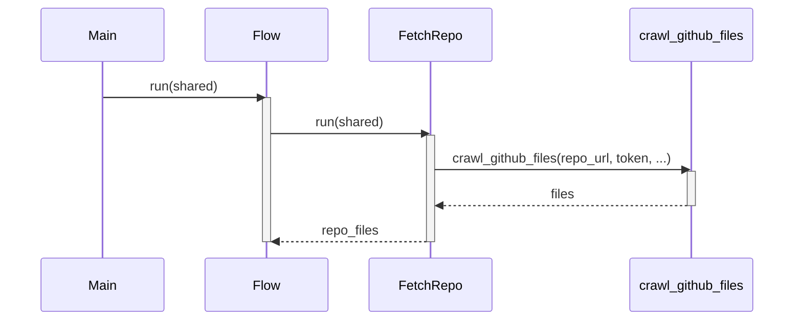

# Chapter 2: Configuration and Defaults

In the previous chapter, [Flow](01_flow.md), we talked about how the Flow acts as a director, orchestrating the entire tutorial generation process. It makes sure everything happens in the right order, from fetching code to writing chapters.

But even the best director needs a script! In this chapter, we'll explore **Configuration and Defaults**, which act like that script for our project. They tell the Flow *what* to do, *where* to find things, and *how* to behave.

## The Problem: A Flexible, Yet Easy-to-Use System

Imagine you want to create a tutorial for a different GitHub repository. Maybe instead of a calculator app, you want a tutorial for a simple game. Without configuration, you'd have to rewrite the entire Flow! That's not very efficient.

Or, what if you only want the tutorial to focus on specific parts of the code? Maybe you want to exclude tests or documentation folders. Again, without configuration, this would be difficult.

**Configuration and Defaults** give us the flexibility to easily customize the tutorial generation process without changing the core code.

## What are Configuration and Defaults?

Think of configuration as a set of settings that control how our project works. These settings can include:

*   **Which GitHub repository to use:** The URL of the repository we want to create a tutorial for.
*   **Include/Exclude file patterns:** Which files shoud be included such as `*.py`, `*.js`, `*.md` and which folders to ignore, such as `tests/*` and `docs/*`.
*   **Output directory:** Where the generated tutorial should be saved.
*   **API Keys:** Access tokens for LLMs like Gemini.

**Defaults** are pre-set values for these settings. They allow the project to work "out of the box" with minimal manual setup. If you don't specify a setting, the default value is used.

## Key Concepts: Settings with Fallbacks

1.  **Configuration File (Not in this project, but good to know):** A file (e.g., `config.yaml` or `.env`) that store configuration settings. We don't use a configuration file directly in this project, BUT we could. Instead, we use command-line arguments which do the same thing! We will show this later in the chapter.

2.  **Command-Line Arguments:**  Values you provide when you run the script.  These override any default values. In our project, we will pass configurations via commandline, such as the file patterns we want to include or exclude.

3.  **Environment Variables:** Variables set in your operating system. This is another way other projects configure their apps. We use an environment variable called `GITHUB_TOKEN`.

4.  **Default Values:**  The values used if you don't provide a setting using command-line arguments or environment variables.

## Using Configuration and Defaults: A Practical Example

Let's say we want to create a tutorial for a repository. Here's how we can use configuration and defaults:

1.  **Run the script with default settings:**

    ```bash
    python main.py https://github.com/pydantic/pydantic
    ```

    In this case, the project uses the default values for everything:
    * Include all common code files as defines in `DEFAULT_INCLUDE_PATTERNS` in file `main.py`.
    * Exclude all tests, build, and docs directories as defined in `DEFAULT_EXCLUDE_PATTERNS` in file `main.py`.
    * Saves the output in a directory called `output`.

2.  **Override the project name by adding the `-n` parameter:**

    ```bash
    python main.py https://github.com/pydantic/pydantic -n "Pydantic Tutorial"
    ```

    Here, we tell the project what to name the project as "Pydantic Tutorial".

3.  **Override certain include and exclude file patterns:**

    ```bash
    python main.py https://github.com/pydantic/pydantic -i "*.py" "*.md" -e "tests/*"
    ```

    Now, we're telling the project to only include python and markdown files (`-i "*.py" "*.md"`) and to exclude anything inside the `tests` directory (`-e "tests/*"`).

4.  **Providing authentication with GitHub Access Token:**

    ```bash
    python main.py https://github.com/private-repo/my-private-code -t "YOUR_GITHUB_TOKEN"
    ```

    Here, we tell the project to authenticate with a GitHub access token (you can generate one in your GitHub settings). Since repositories default to public while those behind private repositories or organizations may need keys. Now the project is able to generate tutorial for the private repo! Note that instead of providing a token with `-t`, you can also store locally in a `.env` file to avoid exposing the token.

## Relevant Code Snippets

Let's look at the code snippets to understand all of this better:

```python
import argparse
import os
import dotenv

dotenv.load_dotenv()

# Default file patterns
DEFAULT_INCLUDE_PATTERNS = {
    "*.py", "*.js", "*.ts", "*.go", "*.java", "*.pyi", "*.pyx", 
    "*.c", "*.cc", "*.cpp", "*.h", "*.md", "*.rst", "Dockerfile", 
    "Makefile", "*.yaml", "*.yml"
}

DEFAULT_EXCLUDE_PATTERNS = {
    "*test*", "tests/*", "docs/*", "examples/*", "v1/*", 
    "dist/*", "build/*", "experimental/*", "deprecated/*", 
    "legacy/*", ".git/*", ".github/*"
}
```

Explanation:

- First we import `argparse` and `os` which are used to read configuration and environment settings. We also enable loading of local `.env` files so users can store keys or configuration.
- Next, we define `DEFAULT_INCLUDE_PATTERNS` and `DEFAULT_EXCLUDE_PATTERNS`, which are the default file patterns that the project will use if you don't specify any.

Let's look at how we read configurations in `main.py`:

```python
def main():
    parser = argparse.ArgumentParser(description="Generate a tutorial for a GitHub codebase.")
    parser.add_argument("repo_url", help="URL of the public GitHub repository.")
    parser.add_argument("-n", "--name", help="Project name (optional, derived from URL if omitted).")
    parser.add_argument("-t", "--token", help="GitHub personal access token (optional, reads from GITHUB_TOKEN env var if not provided).")
    parser.add_argument("-o", "--output", default="output", help="Base directory for output (default: ./output).")
    parser.add_argument("-i", "--include", nargs="+", help="Include file patterns (e.g. '*.py' '*.js'). Defaults to common code files if not specified.")
    parser.add_argument("-e", "--exclude", nargs="+", help="Exclude file patterns (e.g. 'tests/*' 'docs/*'). Defaults to test/build directories if not specified.")
    parser.add_argument("-s", "--max-size", type=int, default=100000, help="Maximum file size in bytes (default: 100000, about 100KB).")

    args = parser.parse_args()

    # Get GitHub token from argument or environment variable
    github_token = args.token or os.environ.get('GITHUB_TOKEN')
    if not github_token:
        print("Warning: No GitHub token provided. You might hit rate limits for public repositories.")

    # Initialize the shared dictionary with inputs
    shared = {
        "repo_url": args.repo_url,
        "project_name": args.name, # Can be None, FetchRepo will derive it
        "github_token": github_token,
        "output_dir": args.output, # Base directory for CombineTutorial output

        # Add include/exclude patterns and max file size
        "include_patterns": set(args.include) if args.include else DEFAULT_INCLUDE_PATTERNS,
        "exclude_patterns": set(args.exclude) if args.exclude else DEFAULT_EXCLUDE_PATTERNS,
        "max_file_size": args.max_size,

        # Outputs will be populated by the nodes
        "files": [],
        "abstractions": [],
        "relationships": {},
        "chapter_order": [],
        "chapters": [],
        "final_output_dir": None
    }
```

Explanation:

- This code uses the `argparse` module to define the command-line arguments that the script accepts.
- For each argument, we can specify a default value. For example, the `output` argument defaults to `"output"`.
- We also read the `GITHUB_TOKEN` environment variable if it's not provided as a command-line argument.
- Finally, we store these configurations in the `shared` dictionary. This dictionary is like a central hub where all the important information about the project is stored. We will dive deeper into [Shared Dictionary](06_shared_dictionary.md) in Chapter 6.

## Under the Hood: How Configuration is Used

Let's see how these configurations are used internally. Remember the `crawl_github_files` function from `utils/crawl_github_files.py`? Configuration is used there!

```python
def crawl_github_files(
    repo_url, 
    token=None, 
    max_file_size: int = 1 * 1024 * 1024,  # 1 MB
    use_relative_paths: bool = False,
    include_patterns: Union[str, Set[str]] = None,
    exclude_patterns: Union[str, Set[str]] = None
):
  ...
```

Explanation:

- `crawl_github_files` gets called by the Flow in [Chapter 1](01_flow.md) after the configurations are set up.
- This function directly reads the `token`, `max_file_size` and `include_patterns`, `exclude_patterns` we just set!

Here's a simplified sequence diagram to illustrate how configuration flows to `crawl_github_files`:



## Why is this important?

Configuration and defaults are essential for:

*   **Flexibility:**  Easily adapt the tutorial generation process for different codebases and scenarios.
*   **Reusability:** Use the same code for multiple projects without rewriting it.
*   **Ease of Use:**  Get started quickly with sensible default settings.
*   **Customization**: Have full control on what parts (files, folders) of the codebase to use in the tutorial.

## Conclusion

In this chapter, we've learned about **Configuration and Defaults**, which allow us to customize our project without changing the core code. We've seen how command-line arguments and environment variables can be used to override default settings.

In the next chapter, we'll dive into [Crawl GitHub Files](03_crawl_github_files.md) in more detail and see how the configurations we've set up are used to fetch the code we need to create our tutorial.


---

Generated by [AI Codebase Knowledge Builder](https://github.com/The-Pocket/Tutorial-Codebase-Knowledge)