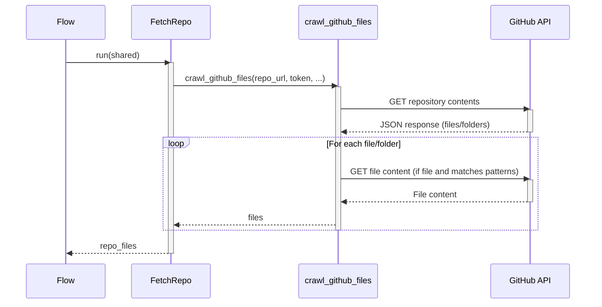

# Chapter 3: Crawl GitHub Files

In the last chapter, [Configuration and Defaults](02_configuration_and_defaults.md), we learned how to tell our project which GitHub repository to use and what kinds of files to include or exclude. Now, we need a way to *actually* go get those files from GitHub!

That's where the "Crawl GitHub Files" utility comes in. It's like a little robot that explores a GitHub repository, finds the files we're interested in, and brings them back to us.

## The Problem: Navigating a Codebase

Imagine you're trying to find a specific file in a huge library. You could wander around aimlessly, opening every book and drawer until you stumble upon it. Or, you could use the library's catalog system to quickly locate the specific file of your interest.

Similarly, codebases can be complex structures with many files and folders. We need a smart way to navigate this structure and extract the files relevant to our tutorial. We also want to avoid downloading huge files or files we explicitly don't need.

The "Crawl GitHub Files" utility solves this problem.

## What is "Crawl GitHub Files"?

The Crawl GitHub Files Utility is like a web crawler, but instead of exploring websites, it explores GitHub repositories.

Here's what it does:

1.  **Connects to GitHub:** It uses the GitHub API (using your provided Token or anonymously) to access the repository.
2.  **Navigates the File Structure:** It follows the links between folders and files.
3.  **Downloads Files:** It downloads the contents of the files we've specified (based on include and exclude patterns).
4.  **Respects Size Limits:** It avoids downloading files that are too big.

## Key Concepts

1.  **Repository URL:** The address of the GitHub repository we want to crawl (e.g., `https://github.com/The-Pocket/Tutorial-Codebase-Knowledge`).

2.  **Include Patterns:** Patterns that define which files we want to include (e.g., `*.py` for Python files).

3.  **Exclude Patterns:** Patterns that define which files we want to exclude (e.g., `tests/*` to ignore test folders).

4.  **File Size Limit:** The maximum size of a file that we're willing to download (to avoid downloading huge files).

5.  **GitHub Token:** Authentication key needed to fetch public repositories without rate limits and for private repositories.

## Using "Crawl GitHub Files": A Practical Example

Let's say we want to get all the Python files from `https://github.com/The-Pocket/Tutorial-Codebase-Knowledge` but exclude the tutorial files. We would configure the Crawl GitHub Files utility like this in `main.py` (as we covered in [Configuration and Defaults](02_configuration_and_defaults.md)):

```bash
python main.py https://github.com/The-Pocket/Tutorial-Codebase-Knowledge -i "*.py" -e "0*.md" "1*.md" "2*.md" "3*.md" "4*.md" "5*.md"
```

This tells the `main.py` application to crawl the GitHub files and to:
1. Use the specified repository at `https://github.com/The-Pocket/Tutorial-Codebase-Knowledge`.
2. `-i "*.py"`: Include all Python files.
3. `-e "0*.md" "1*.md" "2*.md" "3*.md" "4*.md" "5*.md"`: Exclude all markdown files that start with 0, 1, 2, 3, 4, 5 (e.g., `01_flow.md`, `02_configuration_and_defaults.md`).

## Under the Hood: How it Works

The core logic for crawling files resides in `utils/crawl_github_files.py`. Let's break down the important parts.

First, the function definition:

```python
def crawl_github_files(
    repo_url, 
    token=None, 
    max_file_size: int = 1 * 1024 * 1024,  # 1 MB
    use_relative_paths: bool = False,
    include_patterns: Union[str, Set[str]] = None,
    exclude_patterns: Union[str, Set[str]] = None
):
    """
    Crawls files from a GitHub repository based on specified criteria.
    """
    # ... implementation details ...
```

Explanation:

- This function takes the repository URL, optional token, file size limit, include and exclude patterns as input.
-  The main parameters it reads include: `repo_url`, `token`, `max_file_size`, `include_patterns`, `exclude_patterns`. These parameters we set in [Configuration and Defaults](02_configuration_and_defaults.md).
- It returns a dictionary containing the files it found and some statistics about the crawling process.

Now, let's look at a simplified version of how it fetches files:

```python
import requests
import fnmatch
from urllib.parse import urlparse

def crawl_github_files(repo_url, token=None, max_file_size=1000000, use_relative_paths=False, include_patterns=None, exclude_patterns=None):
    files = {}  # Dictionary to store downloaded files
    skipped_files = [] # List of files skipped

    def should_include_file(file_path, file_name):
        # Logic for include/exclude patterns (abbreviated)
        if not include_patterns:
            return True
        else:
            include_file = any(fnmatch.fnmatch(file_name, pattern) for pattern in include_patterns)
            if exclude_patterns and include_file:
                exclude_file = any(fnmatch.fnmatch(file_path, pattern) for pattern in exclude_patterns)
                return not exclude_file
            else:
                return include_file

    # Parse URL and construct API endpoint (abbreviated)
    parsed_url = urlparse(repo_url)
    ...

    def fetch_contents(path):
        # Makes a lot of API requests until it finds all the files and folders

        # Check include and exclude patterns
        if should_include_file(item["path"], item["name"]):
            try:
                file_url = item["download_url"]
                file_response = requests.get(file_url)
                files[rel_path] = file_response.text # Actually save file contents
            except:
                filenames.append((item["path"], file_size))

    #Initial call to the recursive github crawling method
    fetch_contents("")
    
    return {"files": files, "stats": {"downloaded_count": len(files), "skipped_count": len(skipped_files)} }
```

Explanation:

- `should_include_file(file_path, file_name)` function first checks whether a specific file is supposed to be included or excluded.

- `item["download_url"]`: Then with that information, the code proceeds to download the contents of the item, but only if it is a file that’s supposed to be included.

- `files[rel_path] = file_response.text`: The item content is read and saved to the `files` dictionary.

Let's visualize this with a simplified sequence diagram:



1.  The Flow calls the `FetchRepo` node which extracts all the `shared` parameters we saw in [Configuration and Defaults](02_configuration_and_defaults.md).

2.  The `FetchRepo` calls `crawl_github_files(repo_url, token, ...)` using these parameters such as the `repo_url` and the different patterns we want to include and exclude.

3. `crawl_github_files` then calls the GitHub API to fetch information (such as directory information), and also to fetch the file contents if it meets the critera specified for the include exclude patterns, and a number of other criteria.

## Why is this important?

The "Crawl GitHub Files" utility is essential because:

*   **It automates the process of fetching relevant code.** We don't have to manually download files anymore.
*   **It ensures we only get the files we need.** This keeps our tutorial focused and avoids unnecessary information.
*   **It respects size limitations.** This prevents us from accidentally downloading huge files that could slow down the tutorial generation process.

## Conclusion

In this chapter, we've learned about the "Crawl GitHub Files" utility, which is essential for automatically fetching code from GitHub repositories. We've seen how it uses include and exclude patterns, plus size limits, to ensure that we only get the files we need for our tutorial.

In the coming chapters, we'll start diving into how the code is interpreted by LLMs (Language Models).

---


---

Generated by [AI Codebase Knowledge Builder](https://github.com/The-Pocket/Tutorial-Codebase-Knowledge)