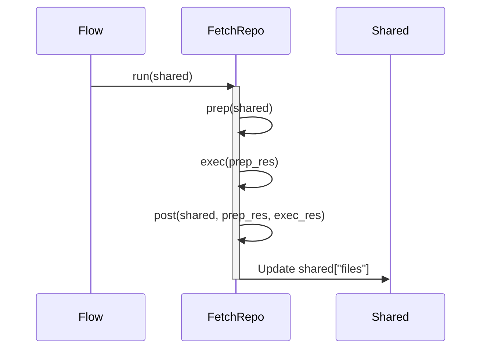

# Chapter 4: Node

```markdown
# Chapter 4: Node

In the previous chapter, [Crawl GitHub Files](03_crawl_github_files.md), we learned how to fetch the code from a GitHub repository and exclude files we don't want. Now, we need units of operation that know how to actually *do* stuff with the files.

Think of a tutorial generation factory! We need workers on an assembly line. These workers need instructions to assemble parts into the final product. This is where `Node` comes in!

## The Problem: Breaking Down the Complex Process

Creating a tutorial involves multiple steps: fetching code, understanding relationships between the code parts, writing explanations, and joining all of it into a nice tutorial. How can we structure these steps and connect them in a flexible and organized way?

Trying to do all of these tasks in one go is like trying to build a whole house yourself. It's much easier to divide the work into smaller, manageable roles.

`Node` is the solution.

## What is a Node?

A `Node` represents a single step in the tutorial generation process. Think of it as a worker in a factory. Each Node performs a specific task, such as:

*   Fetching a repository.
*   Identifying core abstractions or concepts within the codebase.
*   Analysing relationships between these concepts.
*   Writing a chapter of the tutorial.

Because each operation is separated out, we can design the *flow* of the operations. Without `Node`, there would instead be one massive process that gets difficult to debug or re-use in different scenarios.

## Key Concepts

1.  **Task Specialization:**  Each Node has a defined responsibility. This makes the system modular and easy to understand.

2.  **Input and Output:** Nodes take input, perform their task, and produce output. The output of one Node can become the input for another, allowing them to be chained together.

3.  **`prep()` method:**  Transforms `shared` information into arguments to be passed to `exec()`.

4.  **`exec()` method:** Executes the action of that `Node` and returns some content to be ingested.

5.  **`post()` method:** Transforms `exec` output and stores it as `shared` information to be passed downstream.

6.  **`BatchNode`:** A useful extension of the original concept of the `Node` class with capabilities to run operations in parallel.

## Using a Node: A Practical Example

Let's say we have a `FetchRepo` Node that fetches a GitHub repository. Here's how it might work:

1. Prep state and fetch URL - Prep gets the URL to be fetched from a centralized `shared` data object. It will then pass the URL to the `exec()` method.
2. Fetch all files into an object - Then `exec` utilizes the URL to fetch all its file and folder structure into a data object representation.
3. Store this structure into `shared` - Finally `post` will store the data object representation and store it in a shared memory for the `IdentifyAbstractions` Node to find the key code concepts.

## Under the Hood: How it Works

Let's look at the relevant snippets in `nodes.py`:

```python
class FetchRepo(Node):
    def prep(self, shared):
        repo_url = shared["repo_url"]
        project_name = shared.get("project_name")
        if not project_name:
            # Basic name derivation from URL
            project_name = repo_url.split('/')[-1].replace('.git', '')
            shared["project_name"] = project_name

        # Get file patterns directly from shared (defaults are defined in main.py)
        include_patterns = shared["include_patterns"]
        exclude_patterns = shared["exclude_patterns"]
        max_file_size = shared["max_file_size"]

        return {
            "repo_url": repo_url,
            "token": shared.get("github_token"),
            "include_patterns": include_patterns,
            "exclude_patterns": exclude_patterns,
            "max_file_size": max_file_size,
            "use_relative_paths": True
        }

    def exec(self, prep_res):
        print(f"Crawling repository: {prep_res['repo_url']}...")
        result = crawl_github_files(
            repo_url=prep_res["repo_url"],
            token=prep_res["token"],
            include_patterns=prep_res["include_patterns"],
            exclude_patterns=prep_res["exclude_patterns"],
            max_file_size=prep_res["max_file_size"],
            use_relative_paths=prep_res["use_relative_paths"]
        )
        # Convert dict to list of tuples: [(path, content), ...]
        files_list = list(result.get("files", {}).items())
        print(f"Fetched {len(files_list)} files.")
        return files_list

    def post(self, shared, prep_res, exec_res):
        shared["files"] = exec_res # List of (path, content) tuples
```

Explanation:

*   **`prep(self, shared)`:**  This method "prepares" the input data for the Node.  It extracts the `repo_url` from a shared dictionary called `shared`. That `shared` dictionary is passed to all Nodes. It also sanitizes default parameters in the case they are not set in `main.py`.

*   **`exec(self, prep_res)`:** This method contains the core logic of the `FetchRepo` Node. It calls the `crawl_github_files()` utility that we discussed in the previous chapter [Crawl GitHub Files](03_crawl_github_files.md) and gets all the files from the repo.

*   **`post(self, shared, prep_res, exec_res)`:** This method "posts" the results of the `exec` method to a shared dictionary for use by other Nodes! `shared["files"]` are used by subsequent nodes.

Let's visualize this with a simplified sequence diagram:


1. The Flow calls the `FetchRepo` node and passes in the shared memory.
2. `prep()` then will extract the `repo_url` parameter and pass to `exec`
3. `exec` calls external code to process the `repo_url` into a Python data object representation of the file system.
4. `post` then gets called to insert the data object `exec_res` into `shared["files"]`.
5. The reference `shared` is then passed from `FetchRepo` to subsequent `Node` objects to retrieve.

### BatchNode

`BatchNode` is a subclass of `Node`. A BatchNode runs the `exec` method for *every* input separately. Thus it is the best way to parallelize an operation in our whole pipeline, as it can be repeated. A great example of `BatchNode` is in the `WriteChapters` node:

```python
class WriteChapters(BatchNode):
    def prep(self, shared):
        chapter_order = shared["chapter_order"] # List of indices
        abstractions = shared["abstractions"]   # List of dicts, now using 'files' with indices
        files_data = shared["files"]
        # Get already written chapters to provide context
        # We store them temporarily during the batch run, not in shared memory yet
        # The 'previous_chapters_summary' will be built progressively in the exec context
        self.chapters_written_so_far = [] # Use instance variable for temporary storage across exec calls

        # Create a complete list of all chapters
        all_chapters = []
        chapter_filenames = {} # Store chapter filename mapping for linking
        for i, abstraction_index in enumerate(chapter_order):
            if 0 <= abstraction_index < len(abstractions):
                chapter_num = i + 1
                chapter_name = abstractions[abstraction_index]["name"]
                # Create safe filename
                safe_name = "".join(c if c.isalnum() else '_' for c in chapter_name).lower()
                filename = f"{i+1:02d}_{safe_name}.md"
                # Format with link
                all_chapters.append(f"{chapter_num}. [{chapter_name}]({filename})")
                # Store mapping of chapter index to filename for linking
                chapter_filenames[abstraction_index] = {"num": chapter_num, "name": chapter_name, "filename": filename}
        
        # Create a formatted string with all chapters
        full_chapter_listing = "\n".join(all_chapters)

        items_to_process = []
        for i, abstraction_index in enumerate(chapter_order):
            if 0 <= abstraction_index < len(abstractions):
                abstraction_details = abstractions[abstraction_index]
                # Use 'files' (list of indices) directly
                related_file_indices = abstraction_details.get("files", [])
                # Get content using helper, passing indices
                related_files_content_map = get_content_for_indices(files_data, related_file_indices)
                
                # Get previous chapter info for transitions
                prev_chapter = None
                if i > 0:
                    prev_idx = chapter_order[i-1]
                    prev_chapter = chapter_filenames[prev_idx]
                
                # Get next chapter info for transitions
                next_chapter = None
                if i < len(chapter_order) - 1:
                    next_idx = chapter_order[i+1]
                    next_chapter = chapter_filenames[next_idx]

                items_to_process.append({
                    "chapter_num": i + 1,
                    "abstraction_index": abstraction_index,
                    "abstraction_details": abstraction_details,
                    "related_files_content_map": related_files_content_map,
                    "project_name": shared["project_name"],  # Add project name
                    "full_chapter_listing": full_chapter_listing,  # Add the full chapter listing
                    "chapter_filenames": chapter_filenames,  # Add chapter filenames mapping
                    "prev_chapter": prev_chapter,  # Add previous chapter info
                    "next_chapter": next_chapter,  # Add next chapter info
                    # previous_chapters_summary will be added dynamically in exec
                })
            else:
                print(f"Warning: Invalid abstraction index {abstraction_index} in chapter_order. Skipping.")

        print(f"Preparing to write {len(items_to_process)} chapters...")
        return items_to_process # Iterable for BatchNode

    def exec(self, item):
        # This runs for each item prepared above
        abstraction_name = item["abstraction_details"]["name"]
        chapter_num = item["chapter_num"]
        project_name = item.get("project_name")  # Get from item
        print(f"Writing chapter {chapter_num} for: {abstraction_name} using LLM...")

        # Prepare file context string from the map
        file_context_str = "\n\n".join(
            f"--- File: {idx_path.split('# ')[1] if '# ' in idx_path else idx_path} ---\n{content}"
            for idx_path, content in item["related_files_content_map"].items()
        )

        # Get summary of chapters written *before* this one
        # Use the temporary instance variable
        previous_chapters_summary = "\n---\n".join(self.chapters_written_so_far)


        prompt = f"""
Write a very beginner-friendly tutorial chapter (in Markdown format) for the project `{project_name}` about the concept: "{abstraction_name}". This is Chapter {chapter_num}.

Concept Details:
- Description:
{item["abstraction_details"]["description"]}

Complete Tutorial Structure:
{item["full_chapter_listing"]}

Context from previous chapters (summary):
{previous_chapters_summary if previous_chapters_summary else "This is the first chapter."}

Relevant Code Snippets:
{file_context_str if file_context_str else "No specific code snippets provided for this abstraction."}

Instructions for the chapter:
- Start with a clear heading (e.g., `# Chapter {chapter_num}: {abstraction_name}`).

- If this is not the first chapter, begin with a brief transition from the previous chapter, referencing it with a proper Markdown link.

- Begin with a high-level motivation explaining what problem this abstraction solves. Start with a central use case as a concrete example. The whole chapter should guide the reader to understand how to solve this use case. Make it very minimal and friendly to beginners.

- If the abstraction is complex, break it down into key concepts. Explain each concept one-by-one in a very beginner-friendly way.

- Explain how to use this abstraction to solve the use case. Give example inputs and outputs for code snippets (if the output isn't values, describe at a high level what will happen). 

- Each code block should be BELOW 20 lines! If longer code blocks are needed, break them down into smaller pieces and walk through them one-by-one. Aggresively simplify the code to make it minimal. Use comments to skip non-important implementation details. Each code block should have a beginner friendly explanation right after it.

- Describe the internal implementation to help understand what's under the hood. First provide a non-code or code-light walkthrough on what happens step-by-step when the abstraction is called. It's recommended to use a simple sequenceDiagram with a dummy example - keep it minimal with at most 5 participants to ensure clarity. If participant name has space, use: 
`participant QP as Query Processing`

- Then dive deeper into code for the internal implementation with references to files. Provide example code blocks, but make them similarly simple and beginner-friendly.

- IMPORTANT: When you need to refer to other core abstractions covered in other chapters, ALWAYS use proper Markdown links like this: [Chapter Title](filename.md). Use the Complete Tutorial Structure above to find the correct filename. Example: "we will talk about [Query Processing](03_query_processing.md) in Chapter 3".

- Use mermaid diagrams to illustrate complex concepts (```mermaid``` format).

- Heavily use analogies and examples throughout to help beginners understand.

- End the chapter with a brief conclusion that summarizes what was learned and provides a transition to the next chapter. If there is a next chapter, use a proper Markdown link: [Next Chapter Title](next_chapter_filename).

- Ensure the tone is welcoming and easy for a newcomer to understand.

- Output *only* the Markdown content for this chapter.

Now, directly provide a super beginner-friendly Markdown output (DON'T need ```markdown``` tags):
"""
        chapter_content = call_llm(prompt)
        # Basic validation/cleanup
        actual_heading = f"# Chapter {chapter_num}: {abstraction_name}"
        if not chapter_content.strip().startswith(f"# Chapter {chapter_num}"):
             # Add heading if missing or incorrect, trying to preserve content
             lines = chapter_content.strip().split('\n')
             if lines and lines[0].strip().startswith("#"): # If there's some heading, replace it
                 lines[0] = actual_heading
                 chapter_content = "\n".join(lines)
             else: # Otherwise, prepend it
                 chapter_content = f"{actual_heading}\n\n{chapter_content}"

        # Add the generated content to our temporary list for the next iteration's context
        self.chapters_written_so_far.append(chapter_content)

        return chapter_content # Return the Markdown string

    def post(self, shared, prep_res, exec_res_list):
        # exec_res_list contains the generated Markdown for each chapter, in order
        shared["chapters"] = exec_res_list
        # Clean up the temporary instance variable
        del self.chapters_written_so_far
        print(f"Finished writing {len(exec_res_list)} chapters.")
```

*   `prep()` creates a list of "jobs" which represents all the chapters to generate. For each element, it creates all the important information the chapter needs, such as its place on the list/file name and the data to put into a `prompt`.

*   `exec()` gets called for *each* item in the list to be processed. The core action is to call a large language model to write each chapter given a prompt, which itself contains previous chapters for context!

*   `post()` joins the chapters created by `exec()` and stores in `shared["chapters"]`.

## Why is this important?

`Node` and `BatchNode` provide:

*   **Modularity:** Breaking down the complex task into smaller, manageable units.
*   **Reusability:** Each Node can be reused in different Flows or projects.
*   **Testability:** Individual Nodes can be tested independently.
*   **Organization:** Makes it easier to understand and maintain the overall process.
*   **Parallelization:** `BatchNode` enables running the same operation in parallel.

## Conclusion

In this chapter, we've learned about the `Node` and `BatchNode` abstractions. They are essential for structuring our tutorial generation process as a series of independent steps. Each Node performs a specific task, takes input, and produces output that can be used by other Nodes downstream.

In the next chapter, we'll explore [LLM (Language Model)](05_llm__language_model_.md) and demonstrate how a `Node` uses an LLM to perform actual `exec` actions.
```

---

Generated by [AI Codebase Knowledge Builder](https://github.com/The-Pocket/Tutorial-Codebase-Knowledge)