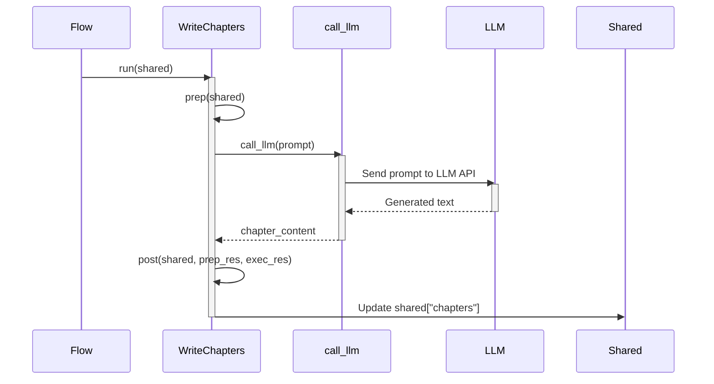

# Chapter 5: LLM (Language Model)

```markdown
# Chapter 5: LLM (Language Model)

In the previous chapter, [Node](04_node.md), we learned how to break down the tutorial generation process into modular units with specific tasks. We discussed `Node`'s `prep`, `exec`, and `post` methods. But one question remains: how do we *actually* perform these tasks?

This is where the LLM (Language Model) comes to play!

## The Problem: Turning Code into Explanations

Imagine having a computer program that can read code and explain it in human-understandable terms. That's a very challenging task, as code is often concise and full of technical jargon.

We need a way to:

1.  Analyze codebases.
2.  Identify core abstractions and concepts.
3.  Write beginner-friendly tutorial chapters.
4.  Connect pieces into a full cohesive tutorial!

The LLM (Language Model) fills this huge need.

## What is an LLM?

The LLM (Language Model) is the AI engine of our system. Think of it as a super-smart assistant that can generate text, translate languages, and answer your questions in an informative way.

In our project, the LLM is responsible for:

*   Analyzing codebases to understand their structure and functionality.
*   Identifying key abstractions and concepts within the code.
*   Writing beginner-friendly tutorial chapters based on its understanding of the codebase.

The LLM uses prompts to understand tasks and generates text based on its training data. We can tell it what we want it to do, and it attempts to follow those instructions. In our `WriteChapters` `Node`, we set specific instructions, such as: "Each code block should have a beginner friendly explanation right after it. Each code block should be BELOW 20 lines!". This makes LLM a crucial component for automatically creating tutorial content from code.

## Key Concepts: Prompts and Models

1.  **Model:** A pre-trained AI that knows how to do a number of operations.

2.  **Prompt:** The actual input that controls what we want the LLM to do.

3.  **Context:** Additional information that we will pass to the LLM so it has the right knowledge to make its response.

## Using an LLM: A Practical Example

Let's say we want to generate a tutorial chapter explaining a simple function in Python. Here's how we can use an LLM within our tutorial-generation project:

1. We fetch all the contents and store in a shared object via previous steps.
2. We use the `IdentifyAbstractions` node the top key abstractions in the codebase and store in the shared object.
3. We analyze their relationships in the `AnalyzeRelationships` node and store that in the shared object.
4. Then the `WriteChapters` retrieves the code files from the `shared["files"]`, details about the abstraction from `shared["abstractions"]`, and context / relationship information from `shared["relationships"]`.
5.  The `WriteChapters` node constructs a prompt that includes:
    *   The name of the function we want to explain.
    *   A description of the function's purpose.
    *   Relevant code snippets.
    *   Instructions on how to format the output.

Here's an example of what the prompt might look like in the `WriteChapters` node:

```python
prompt = f"""
Write a very beginner-friendly tutorial chapter (in Markdown format) for the project `{project_name}` about the concept: "{abstraction_name}". This is Chapter {chapter_num}.

...

Relevant Code Snippets:
{file_context_str if file_context_str else "No specific code snippets provided for this abstraction."}

Instructions for the chapter:
- Start with a clear heading (e.g., `# Chapter {chapter_num}: {abstraction_name}`).
- End the chapter with a brief conclusion that summarizes what was learned and provides a transition to the next chapter.
- Ensure the tone is welcoming and easy for a newcomer to understand.
- Output *only* the Markdown content for this chapter.

Now, directly provide a super beginner-friendly Markdown output (DON'T need ```markdown``` tags):
"""
        chapter_content = call_llm(prompt)

```

## Under the Hood: How it Works

The `call_llm` function in the `utils/call_llm.py` file is responsible for communicating with the LLM. This function sends the prompt to the chosen LLM (e.g., Gemini 2.5 pro, Claude 3.7 Sonnet, OpenAI o1) and retrieves the generated text.

Here's a simplified version of the `call_llm()` function:

```python
from google import genai
import os
import logging
import json
from datetime import datetime

# Configure logging
log_directory = os.getenv("LOG_DIR", "logs")
os.makedirs(log_directory, exist_ok=True)
log_file = os.path.join(log_directory, f"llm_calls_{datetime.now().strftime('%Y%m%d')}.log")

# Set up logger
logger = logging.getLogger("llm_logger")
logger.setLevel(logging.INFO)
logger.propagate = False  # Prevent propagation to root logger
file_handler = logging.FileHandler(log_file)
file_handler.setFormatter(logging.Formatter('%(asctime)s - %(levelname)s - %(message)s'))
logger.addHandler(file_handler)

# Simple cache configuration
cache_file = "llm_cache.json"

# By default, we Google Gemini 2.5 pro, as it shows great performance for code understanding
def call_llm(prompt: str, use_cache: bool = True) -> str:
    # Log the prompt
    logger.info(f"PROMPT: {prompt}")
    
    # Check cache if enabled
    if use_cache:
        # Load cache from disk
        cache = {}
        if os.path.exists(cache_file):
            try:
                with open(cache_file, 'r') as f:
                    cache = json.load(f)
            except:
                logger.warning(f"Failed to load cache, starting with empty cache")
        
        # Return from cache if exists
        if prompt in cache:
            logger.info(f"RESPONSE: {cache[prompt]}")
            return cache[prompt]
    
    # Call the LLM if not in cache or cache disabled
    client = genai.Client(
        vertexai=True, 
        # TODO: change to your own project id and location
        project=os.getenv("GEMINI_PROJECT_ID", "your-project-id"),
        location=os.getenv("GEMINI_LOCATION", "us-central1")
    )
    # You can comment the previous line and use the AI Studio key instead:
    # client = genai.Client(
    #     api_key=os.getenv("GEMINI_API_KEY", "your-api_key"),
    # )
    model = os.getenv("GEMINI_MODEL", "gemini-2.5-pro-exp-03-25")
    response = client.models.generate_content(
        model=model,
        contents=[prompt]
    )
    response_text = response.text
    
    # Log the response
    logger.info(f"RESPONSE: {response_text}")
    
    # Update cache if enabled
    if use_cache:
        # Load cache again to avoid overwrites
        cache = {}
        if os.path.exists(cache_file):
            try:
                with open(cache_file, 'r') as f:
                    cache = json.load(f)
            except:
                pass
        
        # Add to cache and save
        cache[prompt] = response_text
        try:
            with open(cache_file, 'w') as f:
                json.dump(cache, f)
        except Exception as e:
            logger.error(f"Failed to save cache: {e}")
    
    return response_text
```

Explanation:

*   This code uses multiple LLMs such as Google's Gemini.
*   It reads configurations set via `os.getenv()` which are set in environment variables or specified in local `.env` files. This parameter specifies the LLM model to use, along with cache files that will drastically reduce the time for the code to run after running the first time.

Let's visualize this with a simplified sequence diagram showing the `WriteChapters` node to `call_llm`:



1. Flow calls the `WriteChapters` `BatchNode` object, which loops through all the files in the code.
2. We craft prompts based on the file and its file contents and instructions, which gets called by `call_llm`
3. `call_llm` makes the calls to remote LLM APIs and makes sure we don't reveal secrets such as tokens.
4. The chapter content gets stored in `shared["chapters"]`.

## Why is this important?
The LLM is the engine of the operations, without it there is no program because:
*   **Automation:** Automates the process of generating human-readable explanations from code.
*   **Scalability:** Allows us to create tutorials for complex codebases without manual effort.
*   **Beginner-Friendliness:**  Ensures that the generated tutorials are easy for newcomers to understand.

## Conclusion

In this chapter, we've learned about the LLM (Language Model) and its role in our tutorial generation project. We've seen how it uses prompts to understand tasks and generate text, analyze codebases, and identify key abstractions.

In the next chapter, we'll explore [Shared Dictionary](06_shared_dictionary.md) and learn about the shared data store that enables `Nodes` to keep track of progress.
```

---

Generated by [AI Codebase Knowledge Builder](https://github.com/The-Pocket/Tutorial-Codebase-Knowledge)