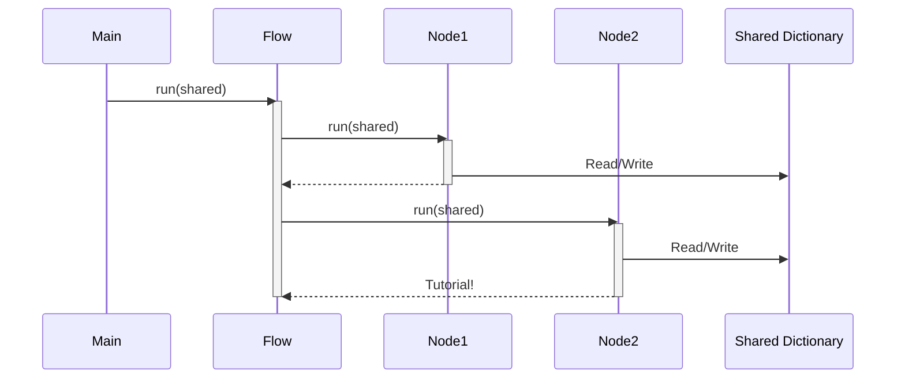

# Chapter 6: Shared Dictionary

```markdown
# Chapter 6: Shared Dictionary

In the previous chapter, [LLM (Language Model)](05_llm__language_model_.md), we discussed how the Language Model helps us create beginner-friendly tutorial content based on code. We explored how it uses prompts to generate text and understand the code.

So, how do different parts of the tutorial know about their progress to make good decisions? This is where the **Shared Dictionary** comes in!

## The Problem: Passing Information Between Components

Imagine you're working on a group project where everyone has their own tasks. Each team member needs information from others to complete their part. If everyone kept their information to themselves, the project would quickly fall apart!

Similarly, in our tutorial generation project, different `Nodes` need to share information with each other. For example:

*   The `FetchRepo` node needs to tell the `IdentifyAbstractions` node about the files it downloaded.
*   The `IdentifyAbstractions` node needs to tell the `WriteChapters` node about the key concepts it identified in the code.
*   The `OrderChapters` node needs to tell the `WriteChapters` node in which order to organize the chapters

Without a way to share this information, each node would be working in isolation, and we wouldn't be able to build a cohesive tutorial.

The solution is the **Shared Dictionary**.

## What is a Shared Dictionary?

The **Shared Dictionary** is like the project's central nervous system, relaying vital information, configurations, and data between various components. Think of it as a project-wide bulletin board, where critical details such as repository URLs, project names, API keys, file lists, identified abstractions, identified relationships, and generated tutorial content reside.

It's a dynamic space where each step of the process adds to or uses specific information.

## Key Concepts

1.  **Centralized Data Storage:** A single place where all important data is stored.
2.  **Key-Value Pairs:** Data is stored as key-value pairs, making it easy to access and update.
3.  **Dynamic:** The contents of the dictionary change as the project progresses.
4.  **Initialization:** Starts mostly emtpy, then by the end the content gets filled and the file list created and the tutorial output generated.

## Using the Shared Dictionary: A Practical Example

Let's walk through an example of how the Shared Dictionary is used in our project:

1.  **Initialization in `main.py`:** In the `main.py` file, we initialize the Shared Dictionary with some basic information like the repository URL and project name from the command line arguments:

    ```python
    # Initialize the shared dictionary with inputs
    shared = {
        "repo_url": args.repo_url,
        "project_name": args.name, # Can be None, FetchRepo will derive it
        "github_token": github_token,
        "output_dir": args.output, # Base directory for CombineTutorial output

        # Add include/exclude patterns and max file size
        "include_patterns": set(args.include) if args.include else DEFAULT_INCLUDE_PATTERNS,
        "exclude_patterns": set(args.exclude) if args.exclude else DEFAULT_EXCLUDE_PATTERNS,
        "max_file_size": args.max_size,

        # Outputs will be populated by the nodes
        "files": [],
        "abstractions": [],
        "relationships": {},
        "chapter_order": [],
        "chapters": [],
        "final_output_dir": None
    }
    ```

    Notice how `shared` at this point only reads in configuration inputs, and that other values such as `files`, `chapters` are initiated as empty lists.

2.  **Data Population in `FetchRepo` Node:**  The `FetchRepo` node fetches the code from the GitHub repository and adds the file list to the Shared Dictionary as the `files` key:

    ```python
    class FetchRepo(Node):
        # ...

        def post(self, shared, prep_res, exec_res):
            shared["files"] = exec_res # List of (path, content) tuples
    ```

    So after this step, shared now has files populated!

3.  **Data Consumption in `IdentifyAbstractions` Node:**  The `IdentifyAbstractions` node reads the file list from the Shared Dictionary to identify the core concepts within the code:

    ```python
    class IdentifyAbstractions(Node):
        def prep(self, shared):
            files_data = shared["files"] ## Access to file content is from here
            # ...
    ```

    So `IdentifyAbstractions` is able to build a prompt by referencing the files!

4.  **Data Consumption and population of chapters** After multiple Nodes process the files based on prompts, `WriteChapters` adds all of the written chapter to the shared `chapters` key, making each chapter aware of the previous context.

5. **Data consumption in the final step.** The final node, `CombineTutorial` makes sure to publish all the information to files using keys such as `final_output_dir`, using all keys now filled in the `shared` variable.

## Under the Hood: How it Works

The Shared Dictionary is simply a Python dictionary that is passed as an argument to the `run()` method of the `Flow` object:

```python
# In main.py
tutorial_flow.run(shared)
```

Each `Node` receives a reference to this same dictionary. Any changes made to the dictionary by one `Node` are immediately visible to all other `Nodes`.

Let's visualize this with a simplified sequence diagram:



1.  The `main.py` script calls the `run()` method of the `Flow` object, passing in the *shared dictionary*.
2.  The `Flow` object calls the `run()` method of the first node, passing in the *same* shared dictionary.
3.  The first node modifies the shared dictionary by adding new information, such as the list of files it downloaded.
4.  The `Flow` object then calls the `run()` method of the second node, passing in the *same* shared dictionary (which now contains the information added by the first node).
5.  This process continues until all nodes have been executed.

## Why is this important?

The Shared Dictionary is essential because:

*   **It enables communication between Nodes:** Different Nodes now know about progress the previous nodes took.
*   **It simplifies data management:** There's only one place to look for all the important data.
*   **It makes the project more modular:** Nodes don't need to know about the internal workings of other nodes, they just need to know how to read and write to the Shared Dictionary.
*   **Allows for chapter to chapter progression and context.** By allowing previous chapters to be available in the shared memory, subsequent nodes and the complete tutorial itself can be made more cohesive.

## Conclusion

In this chapter, we've learned about the Shared Dictionary, the central nervous system of our tutorial generation project. We've seen how it enables communication between Nodes, simplifies data management, and makes the project more modular.

Congratulations, you've completed all the modules of this tutorial! We hope you enjoyed the tutorial and are able to use it in your own project. As next steps feel free to either create a pull request, or to read the code in the codebase. Good luck!
```


---

Generated by [AI Codebase Knowledge Builder](https://github.com/The-Pocket/Tutorial-Codebase-Knowledge)