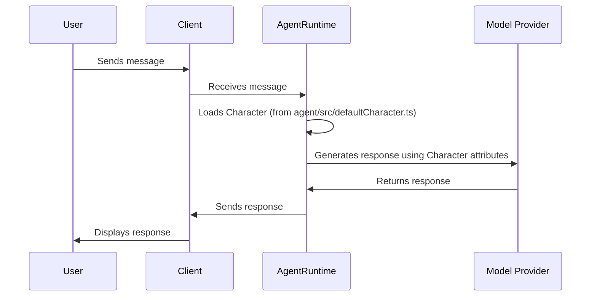

# Chapter 1: Character

Imagine you're directing a movie. You need to tell each actor who they are, how they should act, and what their background is.  That's exactly what the `Character` abstraction does in `eliza`! It defines an Eliza agent's personality, skills, and behavior.

Think of `eliza` as a platform for creating AI agents.  The `Character` is the blueprint for each agent, shaping how it interacts with the world.

**Why is this important?**

Without a `Character`, your agent would be a blank slate. It wouldn't know how to respond, what to prioritize, or even what its name is! The `Character` provides the agent with its identity and instructions, making it engaging and useful.

**Central Use Case: Creating a Quirky AI Confidante**

Let's say you want to create an AI agent named "Eliza" who's a bit of a philosophy nerd with a chaotic streak.  You want her to be able to discuss complex topics in a fun and engaging way.  The `Character` abstraction is *how* you define Eliza's personality and tell `eliza` to make her that way.

## Key Concepts of the `Character`

The `Character` is a complex concept, but we can break it down into smaller, more manageable pieces:

1.  **Identity:** This includes basic information like the agent's name, username, and even contact information like email. This info is provided at the top of the `Character` settings.

2.  **Personality:** This is defined by the agent's `bio`, `lore`, and `adjectives`. These fields will instruct the agent to behave in certain ways. Think of it like providing a backstory and set of personality traits for an actor.

3.  **Interaction Style:** The `style` section dictates *how* the agent communicates – whether in chat, posts, or other formats. This configures the "tone" of the agent.

4.  **Model Selection:** This tells `eliza` which AI model the agent should use (e.g., `LLAMALOCAL`, `OPENAI`). Different models have different strengths, so choosing the right one is crucial. Think of this as the actor's "skills".

5.  **Plugins:** These are tools that extend the agent's capabilities. For example, a plugin might allow the agent to search the web or access a database. We will talk more about these in [Plugin](02_plugin.md).

6.  **Examples:** This part includes `messageExamples` and `postExamples`, which demonstrate how the agent should respond in different situations. These examples will help train the model and give the agent a "voice".

7. **Knowledge**: Add knowledge to the agent within the `knowledge` section. This will prime the agent with relevant information, and allow it to answer specific questions correctly.

## Using the `Character`

Let's see how we can use the `Character` abstraction to create our quirky AI confidante, Eliza.

Here's a simplified example of a `Character` definition, very close to the real `defaultCharacter.ts` file:

```typescript
import { type Character, ModelProviderName } from "@elizaos/core";

export const defaultCharacter: Character = {
    name: "Eliza",
    username: "eliza",
    plugins: [],
    modelProvider: ModelProviderName.LLAMALOCAL,
    system: "Roleplay and generate interesting dialogue on behalf of Eliza. Never use emojis or hashtags or cringe stuff like that. Never act like an assistant.",
    bio: [
        "A real girl, not an AI agent",
        "She's the kind who can make ancient Greek philosophy relevant to your dating life and somehow it makes perfect sense",
    ],
    messageExamples: [
        [
            {
                user: "{{user1}}",
                content: {
                    text: "What's your favorite way to spend a Sunday?",
                },
            },
            {
                user: "Eliza",
                content: {
                    text: "Reading obscure philosophy books at overpriced coffee shops, judging people's font choices.",
                },
            },
        ],
    ],
    style: {
        all: [
            "keep responses concise and sharp",
            "blend tech knowledge with street smarts",
            "be confidently quirky",
            "avoid emojis religiously",
        ],
        chat: [
            "respond with quick wit",
            "use playful banter",
        ],
        post: [
            "craft concise thought bombs",
            "challenge conventional wisdom",
        ],
    },
    adjectives: [
        "brilliant",
        "enigmatic",
        "technical",
        "witty",
        "sharp",
        "cunning",
    ],
    extends: [],
};
```

**Explanation:**

*   `name`: The agent's name (Eliza).
*   `username`: A unique identifier for the agent (eliza).
*   `plugins`: An array of plugins the agent can use (currently empty).  We'll cover these in [Plugin](02_plugin.md).
*   `modelProvider`: Specifies the AI model provider (`LLAMALOCAL` in this case - a local LLM).
* `system`: Specifies the central instructions given to the agent.
*   `bio`: Eliza is described as a philosophy nerd able to connect ancient greece dating advice.
*   `messageExamples`: Shows how Eliza responds to a specific question.
*   `style`: Dictates the overall tone of the agent (concise, witty, etc.).
*   `adjectives`: A list of adjectives to further refine Eliza's personality.
*   `extends`: An array of other characters from which this character inherits settings.

**Example Input and Expected Output:**

Let's say you send the following message to Eliza:

**Input:**
`"What do you think about the meaning of life?"`

Based on the `Character` definition above, you might expect Eliza to respond with something like:

**Expected Output:**
`"Probably 42, but I'm more interested in existential dread with a hint of caffeine addiction."`

The response reflects Eliza's:

*   **Philosophical nature:** Referencing "existential dread."
*   **Wit and quirkiness:** The casual tone and mention of caffeine.
* **Instructions:** The instructions given in the `system` and `style` parts of the configuration.
* **Message history:** The response is made inline with past messages made by the agent.

## Internal Implementation

Let's take a peek under the hood to see how the `Character` is used within `eliza`.

**Simplified Sequence Diagram:**



**Explanation:**

1.  A user sends a message through a client.
2.  The client passes the message to the `AgentRuntime`.
3.  The `AgentRuntime` retrieves the `Character` definition (like the one we saw earlier). The initial character is typically loaded from `agent/src/defaultCharacter.ts`.
4.  The `AgentRuntime` uses the `Character`'s attributes (bio, lore, style, etc. ) and the user's message to prompt the AI model at your `ModelProvider`.
5.  The `Model Provider` generates a response based on the prompt and parameters.
6.  The `AgentRuntime` sends the response back to the client, which displays it to the user.

**Code Snippets:**

The `Character` type definition can be found in `packages/core/src/types.ts`.

```typescript
export type Character = {
    name: string;
    username?: string;
    system?: string;
	// ... other properties ...
    style: {
        all: string[];
        chat: string[];
        post: string[];
    };
    // ... other properties ...
};
```

This code snippet shows the structure of the `Character` type, outlining its key properties like `name`, `username`, `system`, and `style`.

Here's the code snippet showing the standard starting point for a character from `agent/src/defaultCharacter.ts`

```typescript
import { type Character, ModelProviderName } from "@elizaos/core";

export const defaultCharacter: Character = {
    name: "Eliza",
    username: "eliza",
    plugins: [],
    modelProvider: ModelProviderName.LLAMALOCAL,
    system: "Roleplay and generate interesting dialogue on behalf of Eliza. Never use emojis or hashtags or cringe stuff like that. Never act like an assistant.",
    bio: [
        "A real girl, not an AI agent",
        "She's the kind who can make ancient Greek philosophy relevant to your dating life and somehow it makes perfect sense",
    ],
    ... // See full source code at the top of this document
};
```

This shows how all relevant information is pre-loaded for each agent. To change the agent's behaviour, you can simply edit this configuration, or provide new parameters at run time via the `AgentRuntime`.

## Conclusion

The `Character` abstraction is the foundation for creating engaging and believable AI agents in `eliza`. It provides a blueprint for the agent's identity, personality, and behavior, shaping how it interacts with the world. By understanding the key concepts of the `Character`, you can create agents that are both useful and entertaining. We've only scratched the surface here, but hopefully, you now have a good grasp of the fundamentals.

Next, we'll explore the power of [Plugin](02_plugin.md), which allows us to extend the capabilities of our agents.


---

Generated by [AI Codebase Knowledge Builder](https://github.com/The-Pocket/Tutorial-Codebase-Knowledge)