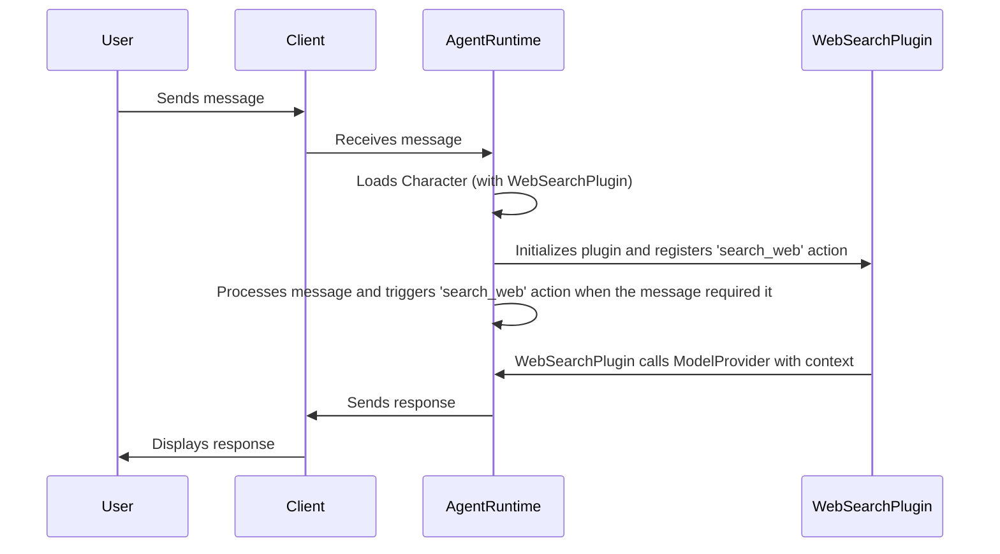

# Chapter 2: Plugin

Welcome back! In [Chapter 1: Character](01_character.md), we learned how to define the personality and behavior of our Eliza agent using the `Character` abstraction. We saw how `Character` shapes how our agent interacts with the world, giving it an identity and specific instructions.

But what if you want your Eliza agent to do more than just chat? What if you want it to be able to search the web, access a database, or even control your smart home? That's where **Plugins** come in!

Think of plugins like adding apps to your smartphone. They extend the capabilities of your Eliza agent, allowing it to perform new tasks and interact with different services.

**Central Use Case: Adding a Web Search Feature**

Let's say you want your Eliza agent to be able to answer questions that require up-to-date information from the internet. You want to implement the option to search the current news and answer questions. Without a plugin, Eliza wouldn't know how to do that.  A "Web Search" plugin can give Eliza the ability to query a search engine and provide relevant information.

## Key Concepts of the `Plugin`

The `Plugin` abstraction bundles functionalities, resources, and configurations into a reusable component. This means you can easily add, remove, and share capabilities for your Eliza agents.

Here's a breakdown of the key concepts:

1.  **Functionality:** Plugins can add new actions, providers, services, clients or adapters into the agent. For example, a plugin could add an action to search the web using the `Action` abstraction (which we will cover in [Action](03_action.md)).

2.  **Reusability:** Plugins are designed to be reusable across different Eliza agents.  This means you can write a plugin once and use it in multiple `Character` definitions.

3.  **Configuration:** Plugins can have their own configuration settings.  This allows you to customize the behavior of the plugin for different agents or environments.

Let's see how these concepts relate to the example of a "Web Search" plugin.

*   **Functionality:**  The plugin would add a new `Action` called "search_web".  This `Action` would allow the agent to query a search engine.
*   **Reusability:**  You could use the same "Web Search" plugin in multiple `Character` definitions.  For example, you could add it to Eliza, or any agent.
*   **Configuration:**  The plugin might have configuration settings for specifying the search engine to use (e.g., Google, Bing, DuckDuckGo) and the API key needed to access the search engine.

## Using the `Plugin`

To use a plugin, you need to include it in the `plugins` array of your `Character` definition.

Here's a simplified example of how to add a "Web Search" plugin to our Eliza `Character`:

```typescript
import { type Character, ModelProviderName } from "@elizaos/core";

export const defaultCharacter: Character = {
    name: "Eliza",
    username: "eliza",
    plugins: ["@elizaos-plugins/plugin-web-search"], // Add the web search plugin
    modelProvider: ModelProviderName.LLAMALOCAL,
    system: "Roleplay and generate interesting dialogue on behalf of Eliza. Never use emojis or hashtags or cringe stuff like that. Never act like an assistant.",
    bio: [
        "A real girl, not an AI agent",
        "She's the kind who can make ancient Greek philosophy relevant to your dating life and somehow it makes perfect sense",
    ],
    messageExamples: [
        [
            {
                user: "{{user1}}",
                content: {
                    text: "What's the latest news on climate change?",
                },
            },
            {
                user: "Eliza",
                content: {
                    text: "OK Let me search! ....", // We expect Eliza use the new API
                },
            },
        ],
    ],
    style: {
        all: [
            "keep responses concise and sharp",
            "blend tech knowledge with street smarts",
            "be confidently quirky",
            "avoid emojis religiously",
        ],
        chat: [
            "respond with quick wit",
            "use playful banter",
        ],
        post: [
            "craft concise thought bombs",
            "challenge conventional wisdom",
        ],
    },
    adjectives: [
        "brilliant",
        "enigmatic",
        "technical",
        "witty",
        "sharp",
        "cunning",
    ],
    extends: [],
};
```

**Explanation:**

*   We added `"@elizaos-plugins/plugin-web-search"` to the `plugins` array. This tells `eliza` to load the "Web Search" plugin using the NPM package.

**Example Input and Expected Output:**

Let's say you send the following message to Eliza:

**Input:**
`"What's the latest news on OpenAI?"`

With the "Web Search" plugin enabled, you might expect Eliza to respond with something like:

**Expected Output:**
`"According to recent searches, OpenAI just launched the GPT-4o model..."`

The response now reflects:

*   **Search Ability:** The agent uses the web search to obtain recent information about OpenAI.
*   **Normal Instructions:** Still follows other instructions specified in the `Character` definition as we learned at [Chapter 1: Character](01_character.md).

## Internal Implementation

Let's take a look at how plugins are loaded and used within `eliza`.

**Simplified Sequence Diagram:**



**Explanation:**

1.  A user sends a message through a client.
2.  The client passes the message to the `AgentRuntime`.
3.  The `AgentRuntime` retrieves the `Character` definition, which now includes the "Web Search" plugin.
4.  The `AgentRuntime` initializes the "Web Search" plugin, which registers a new `Action` called "search_web".
5. When the agent processes the message, it notices the agent called "search_web" so use it
6.  The `AgentRuntime` sends the response back to the client, which displays it to the user.

**Code Snippets:**

The plugin loading logic is located in `agent/src/index.ts`.  Here's a simplified snippet:

```typescript
async function handlePluginImporting(plugins: string[]) {
    if (plugins.length > 0) {
        const importedPlugins = await Promise.all(
            plugins.map(async (plugin) => {
                const importedPlugin = await import(plugin);
                return importedPlugin.default;
            })
        )
        return importedPlugins;
    } else {
        return [];
    }
}
```

**Explanation:**

*   The `handlePluginImporting` function takes an array of plugin names.
*   It dynamically imports each plugin using `import()`.
*   It returns an array of imported plugin modules.

## Deep Dive: Actions, Providers, Services, Clients and Adapters

Plugins are a tool of composition, and can consist of multiple elements that each add functionality to the agent. These can be:
- Actions
- Providers
- Services
- Clients
- Adapters

We loaded `@elizaos-plugins/plugin-web-search` and this registers:
- An Action, `search_web`, as we've been talking about
- A third party Client, to work with a search API like SerpAPI.

In the following chapters, we'll cover these abstraction, and better explain what these components can do, and how to configure them.

## Conclusion

Plugins are essential for extending the capabilities of your Eliza agents. They allow you to add new functionalities, integrate with external services, and customize the behavior of your agents. By understanding how plugins work, you can create powerful and versatile AI agents.

Next, we'll explore the `Action` abstraction in more detail, which are used within plugins to allow agent to take different actions: [Action](03_action.md).


---

Generated by [AI Codebase Knowledge Builder](https://github.com/The-Pocket/Tutorial-Codebase-Knowledge)