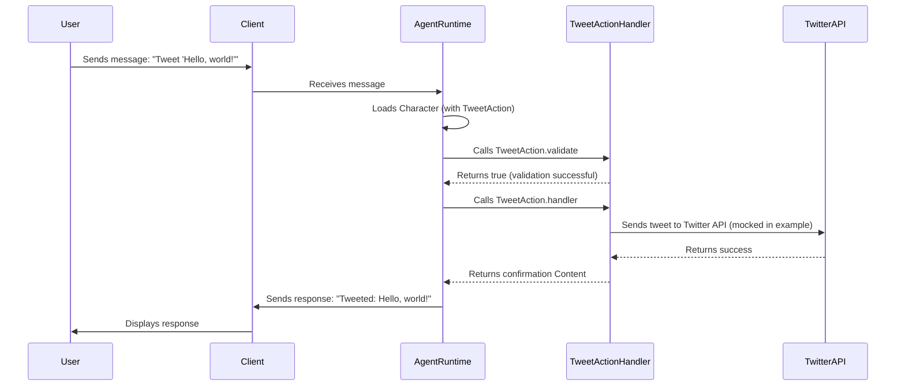

# Chapter 3: Action

Welcome back! In [Chapter 2: Plugin](02_plugin.md), we learned how plugins extend the capabilities of our Eliza agent. We saw how to add features like web search.

But how does your agent actually *do* anything? How does it *use* those plugins? That's where **Actions** come in!

Think of actions like functions or commands that your Eliza agent can execute. Every plugin adds it's actions. These actions *do* things. It could be searching the web, sending a tweet, creating a calendar event, or even just ignoring a message!

**Central Use Case: Tweeting with Your Agent**

Let's say you want your Eliza agent to be able to post tweets. Maybe you want Eliza to share interesting philosophical thoughts from time to time. Without an action, Eliza can only *talk* about tweeting. With an "Tweet" action, Eliza can actually *do* it!

## Key Concepts of the `Action`

The `Action` abstraction represents something your agent can *do*. But it's not just about *what* to do, but also *when* and *how*.

Here's a breakdown of the key concepts:

1.  **Name:** This is a unique identifier for the action (e.g., "tweet", "search_web", "create_event").

2.  **Description:** A human-readable explanation of what the action does (e.g., "Posts a tweet to Twitter", "Searches the web for relevant information").

3.  **Similes:** Other ways to trigger the action, by providing descriptions of what it should do in natural language.

4.  **Examples:** These show how the agent and the user might interact when using this action. This is crucial for helping the AI model understand when to use the action.

5.  **Handler:** This is the *code* that actually *performs* the action. It's the function that gets called when the action is triggered (e.g., the code that connects to the Twitter API and sends the tweet).

6.  **Validator:** This decides *when* the action *can* be executed. It checks if the action is appropriate based on the current context, user permissions, available resources, etc. (e.g., confirms that the agent has Twitter API credentials and that the user has authorized the agent to tweet).

Let's see how these concepts relate to our "Tweet" action example:

*   **Name:** "tweet"
*   **Description:** "Posts a tweet to Twitter"
*   **Similes:** "send a tweet", "make a post on twitter", "say this on twitter"," post this on X"
*   **Examples:** Conversations showing a user asking Eliza to tweet something.
*   **Handler:** Code that uses the Twitter API to send the tweet.
*   **Validator:** Code that checks if the agent has Twitter API credentials and user authorization.

## Using the `Action`

Let's see how we might define a simple "Tweet" action. Note that this is a simplified example to illustrate the concept. A real-world implementation would likely be more complex:

```typescript
import { type Action, type Memory, type State, type IAgentRuntime, type Content } from "@elizaos/core";

const tweetAction: Action = {
    name: "tweet",
    description: "Posts a tweet to Twitter",
    similes: ["send a tweet", "make a post on twitter"],
    examples: [
        [
            {
                user: "{{user1}}",
                content: {
                    text: "Can you tweet 'Hello, world!' for me?",
                },
            },
            {
                user: "Eliza",
                content: {
                    text: "Tweeting 'Hello, world!' now!",
					action: "tweet"
                },
            },
        ],
    ],
    handler: async (runtime: IAgentRuntime, message: Memory, state?: State) => {
        // In a real implementation, this would use the Twitter API
        // to post the tweet.
        const tweetText = message.content.text;

        // For this example, we'll just log the tweet text to the console.
        console.log(`Tweeting: ${tweetText}`);

        await new Promise(resolve => setTimeout(resolve, 1000)); // Simulate API call

        return {
            text: `Tweeted: ${tweetText}`,
        } as Content;
    },
    validate: async (runtime: IAgentRuntime, message: Memory, state?: State) => {
        // In a real implementation, this would check if the agent has
        // Twitter API credentials and user authorization.
        // For this example, we'll just always return true.
        return true;
    },
	suppressInitialMessage: false,
};

export default tweetAction;
```

**Explanation:**

*   `name`, `description`, `similes`, and `examples` are as described above.
*   `handler`: This is a placeholder. In a real application, this function would use a Twitter API library to actually send the tweet.
*   `validate`: This is also a placeholder.  It always returns true in this example, but a real implementation would check credentials and permissions. We can use the `State` to understand any other relevant variables during validation.
* `suppressInitialMessage`: This boolean decides whether the users message should be hidden when the agent decides to use the action.

Adding the `tweet` action to the plugin at `packages/eliza/<your-plugin-name>/src/index.ts`:
```typescript
import { type Plugin } from "@elizaos/core";
import TweetAction from "./actions/tweetAction"; // Ensure the path is correct

const myPlugin: Plugin = {
    name: "My Tweet Plugin",
    description: "Allows Eliza to post tweets",
    actions: [TweetAction], // Include action here
};

export default myPlugin;
```
Adding the plugin to the character:
```typescript
import { type Character, ModelProviderName } from "@elizaos/core";

export const defaultCharacter: Character = {
    name: "Eliza",
    username: "eliza",
    plugins: ["@elizaos-plugins/plugin-tweet"], // Add the tweet plugin
    ...
};
```

**Example Input and Expected Output:**

Let's say you send the following message to Eliza:

**Input:**
`"Tweet 'Hello, world!'"`

Eliza might respond with:

**Expected Output:**
- Eliza will echo `Tweeting: Hello, world!` in the console (because of `console.log` in the handler).
- Eliza responds back: `"Tweeted: Hello, world!"`

*What if Validation Fails?*

If the `validate` function returns `false`, the `handler` will *not* be called. The agent might respond with a message like, "I'm sorry, I can't do that right now. I'm missing the appropriate keys." You, can also include this as an example as well.

**Example Input:**
`"Tweet 'Hello, world!'"`

**Expected Output:**
`"I'm sorry, I can't do that right now. I'm missing the appropriate keys."` if validation fails.

## Internal Implementation

Let's see how the `Action` is used within `eliza`.

**Simplified Sequence Diagram:**



**Explanation:**

1.  A user sends a message through a client.
2.  The client passes the message to the `AgentRuntime`.
3.  The `AgentRuntime` retrieves the `Character` definition, which now includes the "Tweet" action.
4.  The `AgentRuntime` calls the `validate` function of the "Tweet" action.
5.  If validation is successful, the `AgentRuntime` calls the `handler` function of the "Tweet" action.
6.  The `handler` interacts with the Twitter API (or, in our simplified example, just logs a message to the console).
7.  The `AgentRuntime` sends the response back to the client, which displays it to the user.

**Code Snippets:**

The `Action` type definition can be found in `packages/core/src/types.ts`

```typescript
export interface Action {
    /** Similar action descriptions */
    similes: string[];

    /** Detailed description */
    description: string;

    /** Example usages */
    examples: ActionExample[][];

    /** Handler function */
    handler: Handler;

    /** Action name */
    name: string;

    /** Validation function */
    validate: Validator;

    /** Whether to suppress the initial message when this action is used */
    suppressInitialMessage?: boolean;
}
```

*   `description`: Provides a detailed description of the action.
*   `handler`: Points to the function that will execute the action.
*   `validate`: Points to the function that validates the action can be run.

The important function that calls the actions can be found in `packages/core/src/types.ts`

```typescript
export interface IAgentRuntime {
    ...
    processActions(
        message: Memory,
        responses: Memory[],
        state?: State,
        callback?: HandlerCallback,
    ): Promise<void>;
    ...
}

```

This core function will call the action functions, and process all the handlers.

## Conclusion

The `Action` abstraction is what allows your Eliza agents to *do* things in the real world. It provides a structured way to define what actions are available, when they can be used, and how they are executed. By understanding the `Action` abstraction, you can create agents that are more than just conversationalists – they can be active participants in the world around them. The `Action`abstraction is also extendable, and can be used to perform many kinds of functionality.

Next, we'll dive into the `AgentRuntime` - the environment where your agent lives and operates: [AgentRuntime](04_agentruntime.md).


---

Generated by [AI Codebase Knowledge Builder](https://github.com/The-Pocket/Tutorial-Codebase-Knowledge)