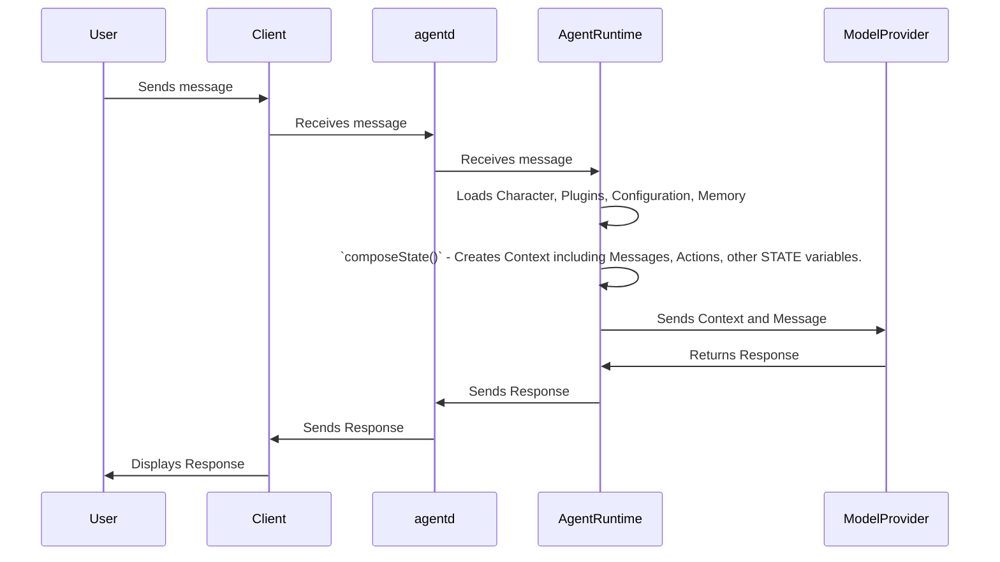

# Chapter 4: AgentRuntime

Welcome back! In [Chapter 3: Action](03_action.md), we learned how to define actions that our Eliza agent can perform, such as tweeting.

But how does Eliza actually *manage* all these actions, her personality, and her memory? How does she coordinate everything to respond appropriately? That's where the **AgentRuntime** comes in!

Think of the `AgentRuntime` as the brain of Eliza. It's the central orchestrator that manages her entire lifecycle, from the moment she's created to the moment she's shut down. It handles her configuration, memory, and interactions with the outside world.

**Central Use Case: Managing Eliza's Memory and Context**

Let's say you're chatting with Eliza about your favorite movies. You mention that you love "The Matrix". Later in the conversation, you ask her what she thinks about sci-fi movies. You want Eliza to remember that you like "The Matrix" and use that information to give you a personalized recommendation.

The `AgentRuntime` is responsible for managing Eliza's memory of the conversation. It keeps track of what you've said, what Eliza has said, and any other relevant information. When you ask about sci-fi movies, the `AgentRuntime` can use that memory to help Eliza provide a more relevant response. It does this by tracking **state**, which we will cover in detail below.

## Key Concepts of the `AgentRuntime`

The `AgentRuntime` is a complex component, but we can break it down into smaller, more manageable pieces:

1.  **Lifecycle Management:** The `AgentRuntime` handles the creation, initialization, running, and shutdown of the agent. It's like the director of a play, making sure everything is in place before the curtain rises.

2.  **Configuration:** The `AgentRuntime` loads and manages the agent's `Character` definition (which we learned about in [Chapter 1: Character](01_character.md)). This includes her name, personality, plugins, etc.

3.  **Memory Management:** The `AgentRuntime` manages the agent's short-term and long-term memory. This includes storing recent messages, user descriptions, and other relevant information.

4.  **Action Orchestration:** When the agent needs to perform an action (like tweeting, as we saw in [Chapter 3: Action](03_action.md)), the `AgentRuntime` is responsible for triggering the appropriate `Action` and handling the results.

5.  **Context Provision:** The `AgentRuntime` gathers and provides relevant context to the AI model. This context can include recent messages, user information, knowledge, and other factors that help the model generate a more informed response. This *context* provides **state**, and is built using the function `composeState()`.

Let's dive deeper into each of these concepts.

### Lifecycle Management

The `AgentRuntime`'s lifecycle management ensures that the agent starts up correctly, runs smoothly, and shuts down cleanly.

When the `AgentRuntime` is created, it:

*   Loads the `Character` definition.
*   Initializes plugins (which are introduced in [Chapter 2: Plugin](02_plugin.md)).
*   Connects to external services (like databases).

When the `AgentRuntime` is shut down, it:

*   Disconnects from external services.
*   Releases resources.

### Configuration

The `AgentRuntime` is configured using the `Character` abstraction. The `Character` defines the agent's personality, skills, and behavior. The `AgentRuntime` loads this `Character` and uses it to guide the agent's interactions.

### Memory Management

The `AgentRuntime` manages different types of memory:

*   **Short-Term Memory:** This includes recent messages in the conversation, which allows the agent to remember what you've just said.
*   **Long-Term Memory:** This can include user descriptions, knowledge about the world, and other information that the agent needs to remember over longer periods.
* **Knowledge**: This includes a wide range of information sources for the agent.

The `AgentRuntime` uses the `MemoryManager` class to handle memory storage and retrieval.

### Action Orchestration

When the agent needs to perform an action, the `AgentRuntime` follows these steps:

1.  It identifies the appropriate `Action` to execute.
2.  It validates that the `Action` can be executed in the current context.
3.  It calls the `Action`'s handler function.
4.  It handles the results of the `Action`.

### Context Provision (Building STATE)

Before the AI model generates a response, the `AgentRuntime` gathers all the relevant information and packages it into a **context**. This context includes:

*   Recent messages
*   User information
*   Knowledge
*   Goals
*   Available actions
*   Anything else that might be relevant to the conversation

Each piece of data provides **state** to the model, and allows it to generate the most relevant response possible. The function that does this, is the most important function within `AgentRuntime`: `composeState()`.

## Using the `AgentRuntime`

You don't directly interact with the `AgentRuntime` in your day-to-day usage of `eliza`. It mostly operates behind the scenes. However, understanding how it works is crucial for customizing your agents and extending their capabilities.

For example, if you want to add a new plugin to your agent, you'll need to understand how the `AgentRuntime` loads and initializes plugins. If you want to modify the agent's memory management, you'll need to understand how the `AgentRuntime` uses the `MemoryManager`.

## Internal Implementation

Let's take a peek under the hood to see how the `AgentRuntime` is implemented within `eliza`.

**Simplified Sequence Diagram:**



**Explanation:**

1.  A user sends a message through a client.
2.  The client passes the message to the `agentd`.
3.  `agentd` passes the message to the `AgentRuntime`.
4.  The `AgentRuntime` loads the `Character`, initializes plugins, loads configuration settings, and manages memory.
5.  The `AgentRuntime` calls the `composeState()` function to build a context for the AI model. This function gathers all the relevant information, like recent messages, user information, available actions, and combines it into a single object.
6.  The `AgentRuntime` sends the context and the user's message to the `ModelProvider`.
7.  The `ModelProvider` generates a response based on the context and the message.
8.  The `AgentRuntime` sends the response back to the client, which displays it to the user.

**Code Snippets:**

The `AgentRuntime` class is defined in `packages/core/src/runtime.ts`.

```typescript
export class AgentRuntime implements IAgentRuntime {
    // ... properties ...

    constructor(opts: {
        // ... options ...
    }) {
        // ... initialization logic ...
    }

    async initialize() {
        // ... initialization logic ...
    }

    async processActions(
        message: Memory,
        responses: Memory[],
        state?: State,
        callback?: HandlerCallback,
    ): Promise<void> {
        // ... action processing logic ...
    }

    async composeState(
        message: Memory,
        additionalKeys: { [key: string]: unknown } = {},
    ) {
       //... data fetching and processing logic ...
    }
}
```

This snippet shows the basic structure of the `AgentRuntime` class, including its constructor. Other functions in the class are called for `initialize`, `processActions`, and `composeState`.

Example of the usage of the AgentRuntime when the messages are going through the platform, the function `startAgent` calls the class declaration in `agent/src/index.ts`.

```typescript
export async function createAgent(
    character: Character,
    token: string
): Promise<AgentRuntime> {
    elizaLogger.log(`Creating runtime for character ${character.name}`);
    return new AgentRuntime({
        token,
        modelProvider: character.modelProvider,
        evaluators: [],
        character,
        // character.plugins are handled when clients are added
        plugins: [
            bootstrapPlugin,
        ]
            .flat()
            .filter(Boolean),
        providers: [],
        managers: [],
        fetch: logFetch,
        // verifiableInferenceAdapter,
    });
}
```
This snippet shows how calling the AgentRuntime instantiates it with the relevant data.

## Conclusion

The `AgentRuntime` is the brain of your Eliza agent, managing its lifecycle, configuration, memory, context, and interactions. It's a complex component, but understanding its key concepts is crucial for customizing your agents and extending their capabilities. By orchestrating all the different parts of the agent, the `AgentRuntime` ensures that your agent is able to respond appropriately and effectively to user messages.

Next, we'll explore the `Content` abstraction, which defines the different types of content that an agent can generate and consume: [Content](05_content.md).


---

Generated by [AI Codebase Knowledge Builder](https://github.com/The-Pocket/Tutorial-Codebase-Knowledge)