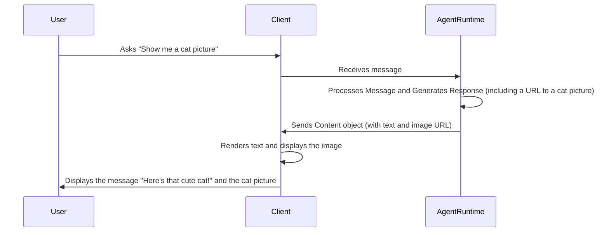

# Chapter 5: Content

Welcome back! In [Chapter 4: AgentRuntime](04_agentruntime.md), we learned how the `AgentRuntime` acts as the brain of our Eliza agent, managing its memory and coordinating its actions.

But what exactly *is* Eliza sending and receiving? What form does this information take as it travels between users, Eliza, and external services? That's where **Content** comes in!

Think of `Content` as the building blocks of communication within `eliza`. It's like the envelope and the letter inside. The `Content` encapsulates the core information being shared.

**Central Use Case: Eliza Showing You a Picture**

Imagine you ask Eliza, "Show me a cute cat picture." Eliza doesn't just respond with "Okay!" She needs to *send* you the actual picture. The `Content` abstraction is how `eliza` represents that picture (or rather, a link to the picture) and sends it to you. In this case, the `Content` would contain a link to the cat picture, and potentially some descriptive text like "Here's that cute cat!".

## Key Concepts of the `Content`

The `Content` abstraction bundles together all the information that flows between different participants in `eliza`. Think of it as a package that contains the core message along with other relevant details.

Here's a breakdown of the key components:

1.  **`text`:** This is the main textual message. It's like the body of an email or the text in a chat message. In our cat picture example, this could be "Here's that cute cat!".

2.  **`attachments`:** These are any associated media files, like images, videos, or audio clips. In our example, this would be the cat picture itself (or, more accurately, a URL pointing to the picture). Attachments come in the form of `Media` as covered below.

3.  **`action`:** This specifies the action that should is being or should be triggered based on this content. Actions were described at [Action](03_action.md).

4.  **`source`:** This identifies the origin of the content (e.g., "direct", "twitter", "slack"). This helps track where the message came from.

5.  **`url`:** This is a web address if relevant.

6.  **`inReplyTo`:** If this content is a reply to another message, this field contains the unique ID of the original message as a `UUID` (unique identifier).

7. **`Media`**: The attachment above refers to a type called `Media`. Here's a bit more, which holds:
    - `id`: A unique string.
    - `url`: Where the file is located.
    - `title`: Name of the file.
    - `source`: Where the media came from.
    - `description`: Extra comments about the file.
    - `text`: Any text associated to the file.
    - `contentType`: such as "image/jpeg", "video/mp4"
    
## Using the `Content`

Let's see how we can use the `Content` abstraction to represent Eliza showing you that cute cat picture.

```typescript
import { type Content } from "@elizaos/core";

const catPictureContent: Content = {
    text: "Here's that cute cat!",
    attachments: [
        {
            id: "cat-picture-123", //Unique ID for the media within system.
            url: "https://example.com/cute-cat.jpg",
            title: "Cute Cat",
            source: "web",
            description: "A picture of a very fluffy cat.",
            text: "This is a picture of a very fluffy cat.",
            contentType: "image/jpeg", //Specifies what type of media
        },
    ],
    source: "eliza",
};

console.log(catPictureContent);
```

**Explanation:**

*   `text`: The main message is "Here's that cute cat!".
*   `attachments`: This is an array containing one `Media` object. (It's an array because you can have multiple attachments).
*   `Media`, fields url, title, source, description and text are populated.
*   `source`: indicates this specific content is coming from the eliza to the user.

**Example Input and Expected Output:**

There's no direct *input* for `Content` in the same way as with `Action`s. The `Content` *is* the input to the user interface or another part of the system.

In this case, the `Console.log(catPictureContent)` statement would output a JavaScript object similar to this:

**Output:**

```json
{
  "text": "Here's that cute cat!",
  "attachments": [
    {
      "id": "cat-picture-123",
      "url": "https://example.com/cute-cat.jpg",
      "title": "Cute Cat",
      "source": "web",
      "description": "A picture of a very fluffy cat.",
      "text": "This is a picture of a very fluffy cat.",
      "contentType": "image/jpeg"
    }
  ],
  "source": "eliza"
}
```

This `Content` object would then be passed to the client (e.g., a web browser or mobile app), which would display the message and the cat picture to the user. In the client, it's up the client's programmers to tell the system how to *render* the text and attachments.

## Internal Implementation

Let's see how `Content` is used inside `eliza`.

**Simplified Sequence Diagram:**



**Explanation:**

1.  A user asks Eliza to show a cat picture.
2.  The client sends the request to the `AgentRuntime`.
3.  The `AgentRuntime` processes the request, perhaps using a plugin to search for a cat picture online.
4.  The `AgentRuntime` creates a `Content` object containing the text "Here's that cute cat!" and the URL of the cat picture.
5.  The `AgentRuntime` sends the `Content` object back to the client.
6.  The client *renders* the `Content`, displaying the text and the picture to the user.

**Code Snippets:**

The `Content` type definition can be found in `packages/core/src/types.ts`. Here is part of the code:

```typescript
export interface Content {
    /** The main text content */
    text: string;

    /** Optional action associated with the message */
    action?: string;

    /** Optional source/origin of the content */
    source?: string;

    /** URL of the original message/post (e.g. tweet URL, Discord message link) */
    url?: string;

    /** UUID of parent message if this is a reply/thread */
    inReplyTo?: UUID;

    /** Array of media attachments */
    attachments?: Media[];

    /** Additional dynamic properties */
    [key: string]: unknown;
}
```

This code defines the structure of the `Content` object: a string `text`, can associate an `action`, identifies the a `source`, includes `attachments` in the form of the `Media` array, and allows for other properties using the `[key: string]: unknown` syntax.

Here's an example from `packages/client-direct/src/index.ts` showing how `Content` is constructed when a message is received:

```typescript
const content: Content = {
    text,
    attachments,
    source: "direct",
    inReplyTo: undefined,
};
```

Here, the `text` of the message, any `attachments`, and a `source` are assembled into a `Content` object.

## Conclusion

The `Content` abstraction is the fundamental unit of communication within `eliza`. It allows you to represent various types of information, from simple text messages to complex data structures with attachments. By understanding the `Content` abstraction, you can create richer and more interactive experiences for your users. The `Content` enables the agent to interact fully with the user.

Next, we are going to cover `ModelProviderName` to choose which model works for each agent: [ModelProviderName](06_modelprovidername.md).


---

Generated by [AI Codebase Knowledge Builder](https://github.com/The-Pocket/Tutorial-Codebase-Knowledge)