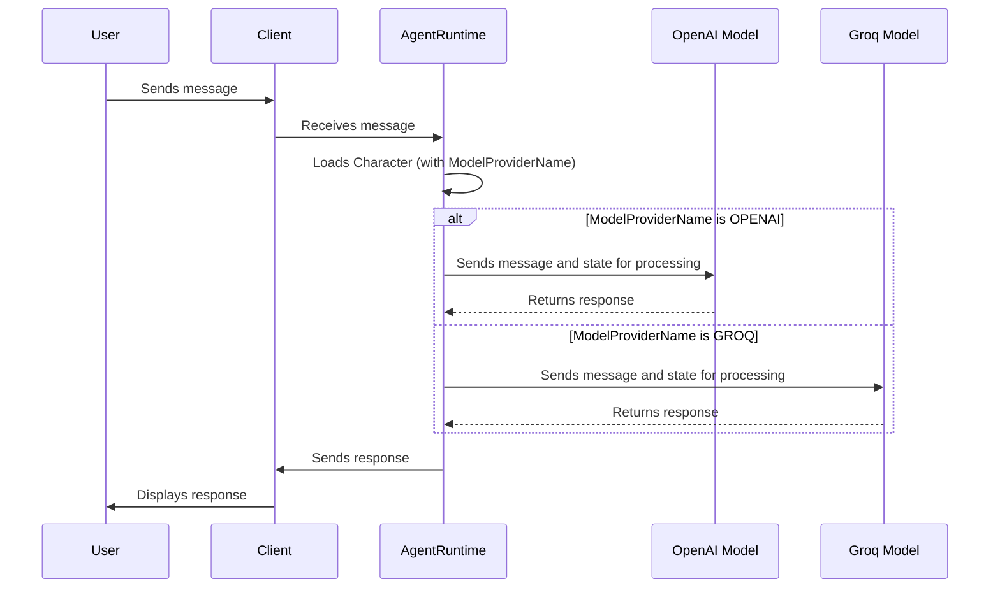

# Chapter 6: ModelProviderName

Welcome back! In [Chapter 5: Content](05_content.md), we learned how `Content` works as the building block for Eliza to send and receive information, like showing you a picture.

But where does Eliza *get* her smarts? Who is providing her ability to understand and respond to your messages? That's where **ModelProviderName** comes in!

Think of `ModelProviderName` like choosing the engine for your car.  It determines *where* Eliza gets her "brainpower" – the AI models that do the actual thinking and generating of responses.

**Central Use Case: Choosing Between OpenAI and Groq for Eliza**

Let's say you want Eliza to be powered by OpenAI's GPT-4 model, known for its high quality and broad capabilities. But maybe you also want to try using Groq, known for its speed. The `ModelProviderName` lets you easily switch between these different AI providers, deciding which "engine" powers Eliza.

## Key Concepts of the `ModelProviderName`

The `ModelProviderName` is like a directory of available AI "engine" providers. It's an enum (a fancy word for a list of named values) that tells Eliza where to find different AI models.

Here's a breakdown:

1.  **Enum:**  `ModelProviderName` itself is an enum. This means it's a list of pre-defined names, like `OPENAI`, `ANTHROPIC`, `GROQ`, and `LLAMALOCAL`.

2.  **Providers:** Each name in the `ModelProviderName` enum represents a different AI "provider." Think of these as companies or services that offer AI models.
    *   `OPENAI`:  This refers to OpenAI, the creators of models like GPT-4 and GPT-3.5.
    *   `ANTHROPIC`:  This refers to Anthropic, another AI company known for its Claude models.
    *   `GROQ`: This refers to Groq, a company focused on fast AI inference.
    *   `LLAMALOCAL`: This refers to a local model, like Llama, installed on your own computer.

3.  **Unique Identifiers:** Each provider name has a unique identifier. This helps `eliza` know exactly which provider you're talking about when you configure your `Character`.

## Using the `ModelProviderName`

Let's see how we can use the `ModelProviderName` to choose OpenAI or Groq for Eliza.

```typescript
import { type Character, ModelProviderName } from "@elizaos/core";

// Example 1: Using OpenAI
export const elizaWithOpenAI: Character = {
    name: "Eliza",
    username: "eliza_openai",
    plugins: [],
    modelProvider: ModelProviderName.OPENAI, // Use OpenAI
    // ... other character settings ...
};

// Example 2: Using Groq
export const elizaWithGroq: Character = {
    name: "Eliza",
    username: "eliza_groq",
    plugins: [],
    modelProvider: ModelProviderName.GROQ, // Use Groq
    // ... other character settings ...
};
```

**Explanation:**

*   In both examples, we're creating a `Character` definition for Eliza.
*   The key difference is the `modelProvider` setting.
*   In `elizaWithOpenAI`, we set `modelProvider` to `ModelProviderName.OPENAI`, telling Eliza to use OpenAI.
*   In `elizaWithGroq`, we set `modelProvider` to `ModelProviderName.GROQ`, telling Eliza to use Groq.

**Example Input and Expected Output:**

There's no direct "input" for `ModelProviderName` in the same way as with `Action`s. You use it to configure your `Character`.

The effect of changing the `ModelProviderName` is that Eliza will use a *different* AI model to generate responses.

*   If you use `ModelProviderName.OPENAI`, Eliza's responses will be generated by OpenAI's models. (GPT-4, GPT-3.5, etc).
*   If you use `ModelProviderName.GROQ`, Eliza's responses will be generated by Groq's models. (Llama, etc).
*   The exact content and quality of the responses will vary depending on the specific AI model used by each provider.

## Internal Implementation

Let's see how `ModelProviderName` is used inside `eliza`.

**Simplified Sequence Diagram:**



**Explanation:**

1.  A user sends a message through a client.
2.  The client sends the request to the `AgentRuntime`.
3.  The `AgentRuntime` loads the `Character` definition, which includes the `ModelProviderName`.
4.  The `AgentRuntime` checks which `ModelProviderName` was specified.
5.  If `ModelProviderName` is `OPENAI`, the `AgentRuntime` uses OpenAI's models to process the message and generate a response.
6.  If `ModelProviderName` is `GROQ`, the `AgentRuntime` uses Groq's models to process the message and generate a response.
7.  The `AgentRuntime` sends the response back to the client, which displays it to the user.

**Code Snippets:**

The `ModelProviderName` enum is defined in `packages/core/src/types.ts`.  Here's the relevant code:

```typescript
export enum ModelProviderName {
    OPENAI = "openai",
    ETERNALAI = "eternalai",
    ANTHROPIC = "anthropic",
    GROK = "grok",
    GROQ = "groq",
    // ... other providers ...
    LLAMALOCAL = "llama_local",
    // ... even more providers ...
}
```

This code shows the different providers `eliza` knows about.

Here's an example from the `packages/core/src/models.ts` file, which maps each `ModelProviderName` to actual model settings:

```typescript
export const models: Models = {
    [ModelProviderName.OPENAI]: {  // Mapping the ModelProviderName
        endpoint: settings.OPENAI_API_URL || "https://api.openai.com/v1",
        model: {
            [ModelClass.SMALL]: {
                name: settings.SMALL_OPENAI_MODEL || "gpt-4o-mini",
                stop: [],
                maxInputTokens: 128000,
                maxOutputTokens: 8192,
                frequency_penalty: 0.0,
                presence_penalty: 0.0,
                temperature: 0.6,
            },
          //... more sizes
        },
    },
    [ModelProviderName.GROQ]: { // Mapping the ModelProviderName
        endpoint: "https://api.groq.com/openai/v1",
        model: {
            [ModelClass.SMALL]: {
                name: settings.SMALL_GROQ_MODEL || "llama-3.1-8b-instant",
                stop: [],
                maxInputTokens: 128000,
                maxOutputTokens: 8000,
                frequency_penalty: 0.4,
                presence_penalty: 0.4,
                temperature: 0.7,
            },
          //... more sizes
        },
    },
 }
```

This code snippet links the enum names with their respective APIs. To use a provider like Groq, you select `GROQ`, which calls its API at `https://api.groq.com/openai/v1`. These various settings of each model dictate how the models themselves function.

## Conclusion

The `ModelProviderName` is a central hub for defining providers to Eliza, like choosing where to source computation from. By understanding `ModelProviderName`, you can tell `eliza` to use different AI models from different providers, experimenting with speed and quality. It is the central choice that drives the style with which the agent responses.

Next, we will explore `Client` to see how to connect Eliza to different platforms: [Client](07_client.md).


---

Generated by [AI Codebase Knowledge Builder](https://github.com/The-Pocket/Tutorial-Codebase-Knowledge)