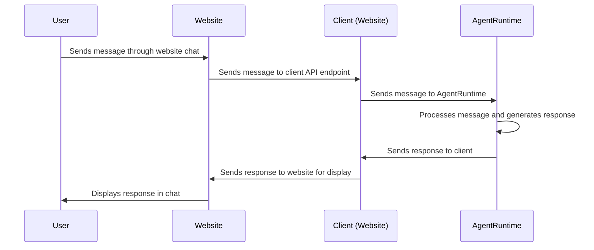

# Chapter 7: Client

Welcome back! In [Chapter 6: ModelProviderName](06_modelprovidername.md), we learned how to choose the AI "engine" that powers Eliza, switching between providers like OpenAI and Groq.

But how does Eliza actually *connect* to the outside world? How does she receive your messages and send her responses back to you? That's where the **Client** comes in!

Think of the `Client` as Eliza's door to the internet. It's the interface she uses to interact with different platforms, like a website, a chat app, or even a social media platform.

**Central Use Case: Connecting Eliza to a Website**

Let's say you want to embed Eliza on a website so visitors can chat with her directly. You need a way for Eliza to receive messages from the website's chat interface and send her responses back to be displayed. The `Client` abstraction lets you create a "website client" that handles this communication. It could register endpoints for HTTP interactions, handle user authentication, and format messages for the web interface.

## Key Concepts of the `Client`

The `Client` abstraction defines how Eliza interacts with a specific platform.  It's like a translator and a delivery service all in one, transforming messages into a format the platform understands and sending Eliza's responses back in a way the platform can display.

Here's a breakdown of the key concepts:

1.  **Name:** This is a unique identifier for the client (e.g., "website", "discord", "telegram").

2.  **Configuration:**  This allows you to specify settings specific to the platform. For instance, a Discord client might need a bot token, while a website client might need an API key.

3.  **`start()`:** This function is where the client actually *connects* to the platform. It sets up listeners for incoming messages and prepares the client to send messages back. It's like opening the door and setting up the welcome mat!

4.  **`stop()`:** This function disconnects the client from the platform, closing the door and cleaning up any resources.

Let's see how these concepts relate to our "website client" example:

*   **Name:** "website"
*   **Configuration:**  This could include the port number the website uses, API keys, and settings for user authentication.
*   **`start()`:** This function would set up a web server to listen for HTTP requests containing user messages and connect to internal agents running.
*   **`stop()`:** This function would shut down the web server. Also, it must call the `AgentRuntime`'s client stop function to unregister any services.

## Using the `Client`

Let's see how we might define a simple "website" client. Note that this is a simplified example, and a real-world implementation would likely be more complex.

```typescript
import { type Client, type IAgentRuntime } from "@elizaos/core";

const websiteClient: Client = {
    name: "website",
    config: {
        port: 3001, // The port the website uses
    },
    start: async (runtime: IAgentRuntime) => {
        console.log("Starting website client on port", websiteClient.config?.port);
        // In a real implementation, this function would:
        // 1. Set up a web server (e.g., using Express.js)
        // 2. Define API endpoints for receiving messages from the website
        // 3. Connect to Eliza's AgentRuntime to send and receive messages
        return {
          stop: async (runtime: IAgentRuntime) => {
            console.log("Stopping website client");
            // disconnect Eliza with "http://localhost:3001/stop"
        }
      };
    },
};

export default websiteClient;
```

**Explanation:**

*   `name`: Sets the name to "website".
*   `config`: sets the standard port Eliza runs on.
*   `start()`: We've added console logs. Normally, this would kick off the web server. However, we need to kick off a `stop()` signal here as well, to deregister the processes that `Eliza` is managing at run time.
*   `stop()`: A real implementation would shut down the web server and clean up resources.

To use this client, you would include it in the `clients` array of your plugin definition, add to add the plugin to the Character, in the same way as [Chapter 2: Plugin](02_plugin.md).

**Example Input and Expected Output:**

There's no direct *input* for the client *definition* itself. The client becomes active when it's `start()`ed.

The *effect* of starting the "website" client is that:

*   Eliza will be able to receive messages sent to the API endpoints defined in the `start()` function (e.g., `http://localhost:3001/message`).
*   Eliza will be able to send responses back to the website to be displayed in the chat interface.

## Internal Implementation

Let's see how the `Client` is used within `eliza`.

**Simplified Sequence Diagram:**



**Explanation:**

1.  A user sends a message through the website's chat interface.
2.  The website sends the message to an API endpoint provided by the "website" client.
3.  The "website" client receives the message and sends it to the `AgentRuntime`.
4.  The `AgentRuntime` processes the message and generates a response.
5.  The `AgentRuntime` sends the response back to the "website" client.
6.  The "website" client sends the response to the website, which displays it in the chat interface.

**Code Snippets:**

The `Client` type definition can be found in `packages/core/src/types.ts`. Here's the relevant code:

```typescript
export type Client = {
    /** Client name */
    name: string;

    /** Client configuration */
    config?: { [key: string]: any };

    /** Start client connection */
    start: (runtime: IAgentRuntime) => Promise<ClientInstance>;
};
```

This code defines the basic structure of a `Client`, including its `name`, `config`, and `start` function.

Here's a snippet from within the `AgentRuntime`, where the `start` functions of the clients are called. The below functionality makes it possible for an agent to be called from multiple places.

```typescript
async initialize() {
    // ... other initialization ...

    this.clients = await Promise.all(
        this.plugins
            .map((plugin) => plugin.clients ?? [])
            .flat()
            .map(async (client) => {
                return await client.start(this);
            })
    );
    // ... more initialisation ...
}
```

## Conclusion

The `Client` Abstraction is what provides external users to communicate with `Eliza`! By connecting `Eliza` to many different clients like `Discord` or `Telegram`, end users can use `Eliza` in the places that work best for them. It provides the means for messages to be sent and generated effectively.

Next, we'll explore `DatabaseAdapter` to see how to connect Eliza to persistent storage to remember all this great information: [DatabaseAdapter](08_databaseadapter.md).


---

Generated by [AI Codebase Knowledge Builder](https://github.com/The-Pocket/Tutorial-Codebase-Knowledge)