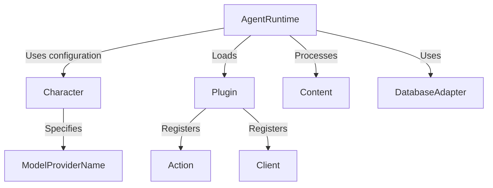

# Tutorial: eliza

`eliza` is a project that allows you to create customizable, conversational AI agents.  These agents, or **Characters**, are defined by their *personality* and *skills*. The agents use **Plugins** to extend their abilities and a central **AgentRuntime** to manage their operations and **ModelProviderNames** to perform tasks.

**Source Repository:** [git@github.com:elizaOS/eliza.git](git@github.com:elizaOS/eliza.git)

## Chapters

1. [Character](01_character.md)
2. [Plugin](02_plugin.md)
3. [Action](03_action.md)
4. [AgentRuntime](04_agentruntime.md)
5. [Content](05_content.md)
6. [ModelProviderName](06_modelprovidername.md)
7. [Client](07_client.md)
8. [DatabaseAdapter](08_databaseadapter.md)

---

Generated by [AI Codebase Knowledge Builder](https://github.com/The-Pocket/Tutorial-Codebase-Knowledge)