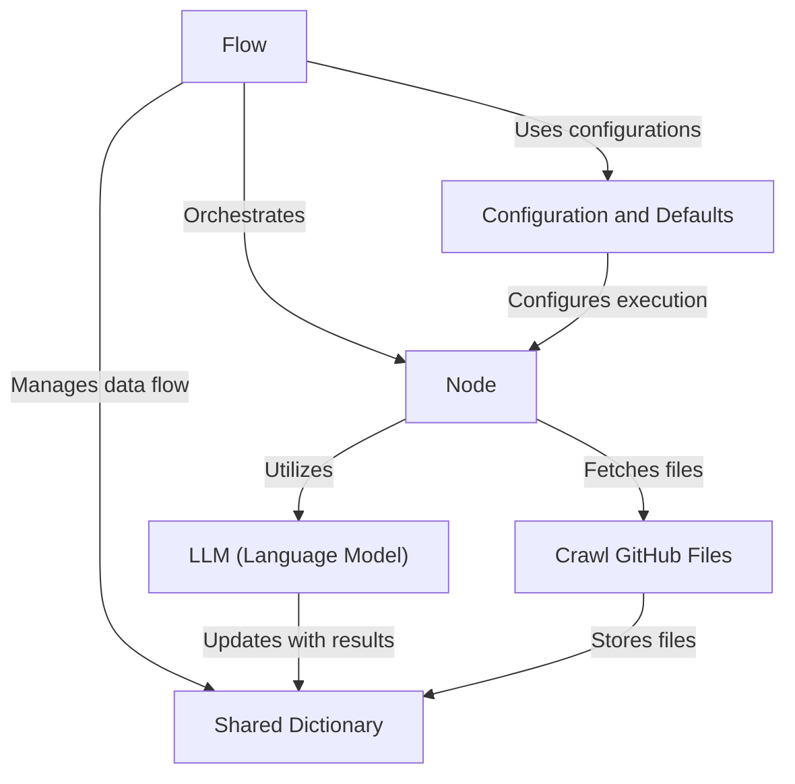

# Tutorial: Tutorial-Codebase-Knowledge

The project  aims to simplify the process of generating educational tutorials for codebases. It utilizes LLMs to identify core concepts, understand code relationships, and produce beginner-friendly explanations, helping users to unlock knowledge of complex software projects in a guided *learning* experience. This process transforms a codebase into a **structured**, easy-to-understand tutorial, acting as a bridge between a sprawling codebase and curious developers.

**Source Repository:** [https://github.com/The-Pocket/Tutorial-Codebase-Knowledge](https://github.com/The-Pocket/Tutorial-Codebase-Knowledge)

## Chapters

1. [Flow](Tutorial-Codebase-Knowledge/01_flow)
2. [Configuration and Defaults](Tutorial-Codebase-Knowledge/02_configuration_and_defaults)
3. [Crawl GitHub Files](Tutorial-Codebase-Knowledge/03_crawl_github_files)
4. [Node](Tutorial-Codebase-Knowledge/04_node)
5. [LLM (Language Model)](Tutorial-Codebase-Knowledge/05_llm__language_model_)
6. [Shared Dictionary](Tutorial-Codebase-Knowledge/06_shared_dictionary)

---

Generated by [AI Codebase Knowledge Builder](https://github.com/The-Pocket/Tutorial-Codebase-Knowledge)