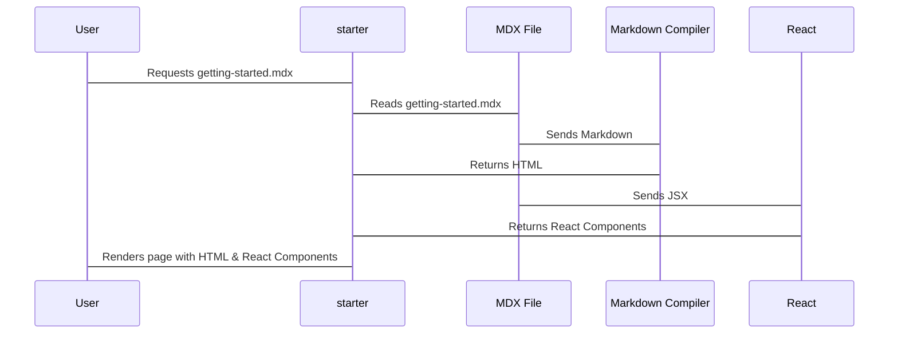

# Chapter 1: Documentation Pages (MDX Files)

Welcome! This is the first chapter in your journey to creating awesome documentation with `starter`. We're going to start with the most basic building block: documentation pages.

Imagine you're writing a cookbook. Each recipe – with its title, ingredients, instructions, and maybe even a picture – lives on its own page. In `starter`, these individual "recipe pages" are called **Documentation Pages**, and they're created using something called **MDX files.**

What problem do MDX files solve? They give you a simple, yet powerful way to create and structure your documentation content.  Instead of struggling with complex code, you can use a familiar writing style (Markdown) with the ability to add interactive elements (using React components).

Let's say you want to create a simple "Getting Started" page for your project. MDX files make this easy.

## Key Concepts: Markdown and JSX

Before we dive into creating a page, let's understand the two pieces that make up MDX:

*   **Markdown:** Think of Markdown as a super-easy way to format text.  It uses simple symbols to create headings, lists, bold text, and more. For example, to create a title, you use a `#` symbol. To make text bold, you surround it with `**`. If you've ever used a simpler formatting language like on Discord or Reddit, this is a superset of those!

*   **JSX:** This is where the "X" in MDX comes from! JSX allows you to use React components directly within your Markdown. React is a popular JavaScript library for building user interfaces.  Basically, JSX lets you add things like interactive buttons, custom layouts, and anything else you can build with React, right into your documentation page. Don't worry if you haven't used React before – we'll start with simple examples, and you can learn more later!

## Creating Your First MDX File

Let's create our "Getting Started" page.

1.  **Create a new file:** In your `starter` project, navigate to the directory where you want to store your documentation pages (often a `docs` or `pages` directory). Create a new file named `getting-started.mdx`.

2.  **Add content:** Open `getting-started.mdx` in your favorite text editor and add the following:

```mdx
---
title: 'Getting Started'
description: 'A quick guide to get you up and running.'
---

# Welcome!

This is a simple guide to help you get started with our awesome project.

## Step 1: Installation

Follow these instructions to install the project:

```bash
npm install my-awesome-project
```

## Step 2: Configuration

Configure the project by editing the `config.json` file.
```
config.json:
{
  "apiKey": "YOUR_API_KEY"
}
```
```
```

**Explanation:**

*   The lines between the `---` are called **frontmatter**. This is special metadata for your page.
    *   `title`: This is the title of your page, which will be displayed in the browser tab and navigation.
    *   `description`: This is a short description of your page, which can be used for search engine optimization (SEO).
*   `# Welcome!`: This creates a main heading (an `<h1>` tag in HTML).
*   `## Step 1: Installation`: This creates a subheading (an `<h2>` tag in HTML).
*   The code blocks enclosed in triple backticks (`````) are code snippets. You can specify the language for syntax highlighting by adding the language name after the first set of backticks (e.g., `bash`, `json`).

## Viewing Your Page

Right now, your documentation site might still be empty, it probably doesn't know about the new page you just created. So you need to tell `starter` about this new page, so it shows it in the navigation.

That's done through a configuration file called `docs.json`. We'll talk more about [Navigation Configuration](02_navigation_configuration.md) in the next chapter, but for now just create a basic one if one doesn't exist in the root directory and make it look like this:

```json
{
  "name": "My Awesome Project",
  "navigation": {
    "tabs": [
      {
        "tab": "Docs",
        "groups": [
          {
            "group": "Getting Started",
            "pages": ["getting-started"]
          }
        ]
      }
    ]
  }
}
```

Now, when you run your `starter` documentation site locally, you should see your "Getting Started" page in the navigation!

**Explanation:**
*   `"name"` sets the global title/name of your project documentation.
*   Under `"navigation"`, we define how your pages are organized in the sidebar.
*   `"tab"` creates the tab in the navigation bar, such as "Docs" or "API Reference".
*   `"group"` groups the pages in the navigation bar, such as "Getting Started" or "Essentials".
*   `"pages"` lists the MDX files (without the `.mdx` extension) that belong to the group.

Just to reiterate, with the contents in getting-started.mdx being the following:

```mdx
---
title: 'Getting Started'
description: 'A quick guide to get you up and running.'
---

# Welcome!

This is a simple guide to help you get started with our awesome project.

## Step 1: Installation

Follow these instructions to install the project:

```bash
npm install my-awesome-project
```

## Step 2: Configuration

Configure the project by editing the `config.json` file.
```
config.json:
{
  "apiKey": "YOUR_API_KEY"
}
```
```
```

And with the docs.json file at the root directory having the values:

```json
{
  "name": "My Awesome Project",
  "navigation": {
    "tabs": [
      {
        "tab": "Docs",
        "groups": [
          {
            "group": "Getting Started",
            "pages": ["getting-started"]
          }
        ]
      }
    ]
  }
}
```

After completing these two steps, your documentation site will render a page with the title "Getting Started" and the steps "Installation" and "Configuration".

## Adding Interactivity with JSX (A Sneak Peek)

Let's add a simple button to our page using JSX.  Don't worry too much about understanding the React code right now – just focus on how it's embedded in the MDX file.

```mdx
---
title: 'Getting Started'
description: 'A quick guide to get you up and running.'
---

# Welcome!

This is a simple guide to help you get started with our awesome project.

<button style={{ backgroundColor: 'blue', color: 'white', padding: '10px' }}>
  Click Me!
</button>

## Step 1: Installation

Follow these instructions to install the project:

```bash
npm install my-awesome-project
```

## Step 2: Configuration

Configure the project by editing the `config.json` file.
```json
{
  "apiKey": "YOUR_API_KEY"
}
```
```

```

**Explanation:**

*   `<button ...>`: This is a standard HTML button element, but we're adding some inline CSS styles using JSX's curly braces `{}`. This gives us more control over the button's appearance.

When you refresh your documentation site, you'll now see a blue button on your "Getting Started" page!

## Under the Hood: How MDX Works

So, what's happening behind the scenes when `starter` processes your MDX file?

1.  **Parsing:** The MDX file is read and parsed. The sections that are Markdown are identified, as well as the sections that are JSX.
2.  **Compilation:** The Markdown is converted into HTML. The JSX is compiled into JavaScript code that React can understand.
3.  **Rendering:** React takes the compiled JavaScript and renders the HTML, including the HTML from Markdown and the parts dictated by the JSX elements.
4.  **Display:** The final HTML is sent to the browser, which displays your documentation page.

Here's a simplified sequence diagram:



## Example from the starter docs

Take a look at the code for a page from within the starter docs, such as `essentials/code.mdx`:

```mdx
---
title: 'Code Blocks'
description: 'Display inline code and code blocks'
icon: 'code'
---

## Basic

### Inline Code

To denote a `word` or `phrase` as code, enclose it in backticks (`).

```
To denote a `word` or `phrase` as code, enclose it in backticks (`).
```

### Code Block

Use [fenced code blocks](https://www.markdownguide.org/extended-syntax/#fenced-code-blocks) by enclosing code in three backticks and follow the leading ticks with the programming language of your snippet to get syntax highlighting. Optionally, you can also write the name of your code after the programming language.

```java HelloWorld.java
class HelloWorld {
    public static void main(String[] args) {
        System.out.println("Hello, World!");
    }
}
```

````md
```java HelloWorld.java
class HelloWorld {
    public static void main(String[] args) {
        System.out.println("Hello, World!");
    }
}
```
````
```

This file shows an example of using both inline code and code blocks. The frontmatter defines the title, description, and icon for the page. As you can see in the markdown, triple backticks define whether you are defining code blocks. You can optionally also add a language, such as `java`.

## Conclusion

In this chapter, you've learned about documentation pages and MDX files. You've seen how to create a basic page, add content using Markdown, and even sneak a peek at how to add interactivity with JSX.

In the next chapter, we'll dive deeper into how to control the navigation of your documentation site using  [Navigation Configuration](02_navigation_configuration.md). Great job!


---

Generated by [AI Codebase Knowledge Builder](https://github.com/The-Pocket/Tutorial-Codebase-Knowledge)