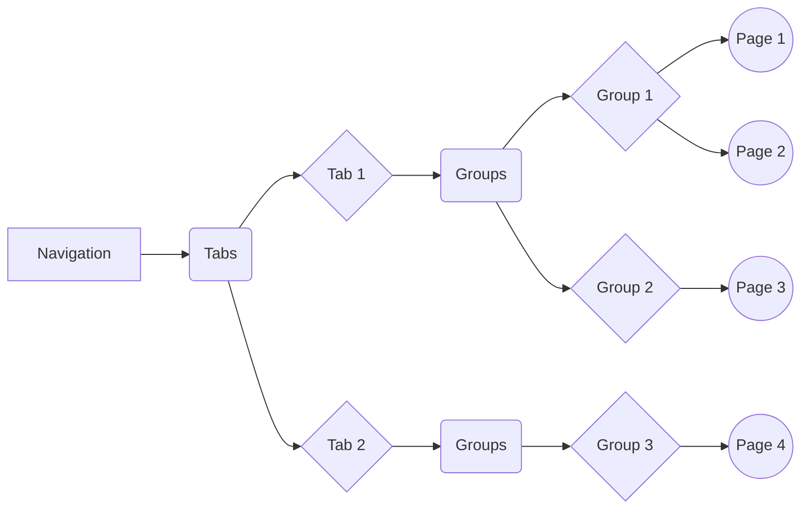
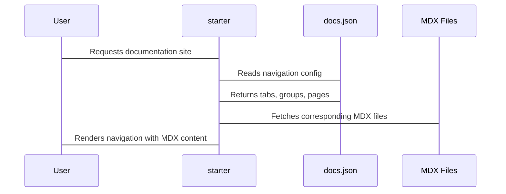

# Chapter 2: Navigation Configuration

Welcome back! In the [previous chapter](01_documentation_pages__mdx_files_.md), we learned how to create individual documentation pages using MDX files. Now, let's learn how to organize those pages into a structured and easy-to-navigate documentation site. That's where **Navigation Configuration** comes in!

Imagine you're building a website with different sections, like "Home," "About," and "Products."  Users need a menu to easily jump between these sections. In `starter`, the navigation configuration is how you create that menu for your documentation.

**Why is navigation configuration important?**

Without it, all your beautiful MDX pages would just be floating around, inaccessible to your users! Think of it like this: you could write the best recipes in the world, but if your cookbook has no table of contents or index, nobody would be able to find the dish they're looking for!

Let's explore how to make your documentation easy to navigate.

## Key Concepts: Tabs, Groups, and Pages

The navigation in `starter` is structured using three key concepts:

1.  **Tabs:** These are the top-level categories in your navigation. Think of them like the main sections of your website (or the different types of cuisine in your cookbook!). For example, you might have tabs for "Docs," "API Reference," and "Tutorials."

2.  **Groups:** These are sub-sections within a tab. They help you organize pages within the same broad category.  Using the cookbook analogy, under the "Docs" tab, you might have groups like "Getting Started," "Configuration," and "Advanced Topics."

3.  **Pages:** These are the individual documentation files (your MDX files!) that we created in the previous chapter.  These are the individual recipes that live within each section of each cuisine in your cookbook.  The end-user is trying to locate and understand these specific pages.

Here's a visual representation:



## The `docs.json` File

All this configuration lives in a file called `docs.json`. We'll dive deep into the full `docs.json` file in the [next chapter](03_docs_json__configuration_file_.md), but for now, let's focus on the `navigation` part.

## Configuring Your Navigation

Here's an example of how you can set up your navigation in `docs.json`:

```json
{
  "name": "My Awesome Project",
  "navigation": {
    "tabs": [
      {
        "tab": "Docs",
        "groups": [
          {
            "group": "Getting Started",
            "pages": ["introduction", "installation"]
          },
          {
            "group": "Configuration",
            "pages": ["api-keys", "settings"]
          }
        ]
      },
      {
        "tab": "API Reference",
        "groups": [
          {
            "group": "Endpoints",
            "pages": ["users", "products"]
          }
        ]
      }
    ]
  }
}
```

**Explanation:**

*   `"name"`: This sets the name of your project, which will be displayed at the top of your documentation site.
*   `"navigation"`:  This is where we define the structure of our navigation.
*   `"tabs"`: This is an array of tabs. Each tab is an object with two keys: `"tab"` (the name of the tab) and `"groups"` (an array of groups within that tab).
*   `"groups"`: This is an array of groups. Each group is an object with two keys: `"group"` (the name of the group) and `"pages"` (an array of page names within that group).
*   `"pages"`: This is an array of page names.  **Important:** These names should match the filenames of your MDX files *without* the `.mdx` extension.  For example, if you have a file named `introduction.mdx`, you would simply use `"introduction"` in the `"pages"` array.

**What Happens When You Use This Configuration?**

When `starter` reads this `docs.json` file, it will generate a navigation menu with:

*   Two tabs: "Docs" and "API Reference."
*   The "Docs" tab will have two groups: "Getting Started" and "Configuration."
*   The "Getting Started" group will have two pages: "introduction" and "installation."
*   The "Configuration" group will have two pages: "api-keys" and "settings."
*   The "API Reference" tab will have one group: "Endpoints."
*   The "Endpoints" group will have two pages: "users" and "products."

## Building Your Own Navigation

Let's say you have the following MDX files:

*   `docs/getting-started.mdx`
*   `docs/configuration.mdx`
*   `api/users.mdx`
*   `api/products.mdx`

You want to organize them as follows:

*   A "General" tab with a "Documentation" group containing "Getting Started" and "Configuration."
*   An "API" tab with an "Endpoints" group containing "Users" and "Products."

Here's the `docs.json` configuration you would use:

```json
{
  "name": "My Awesome Project",
  "navigation": {
    "tabs": [
      {
        "tab": "General",
        "groups": [
          {
            "group": "Documentation",
            "pages": ["docs/getting-started", "docs/configuration"]
          }
        ]
      },
      {
        "tab": "API",
        "groups": [
          {
            "group": "Endpoints",
            "pages": ["api/users", "api/products"]
          }
        ]
      }
    ]
  }
}
```

The MDX code for `docs/getting-started.mdx` can look like this:

```mdx
---
title: 'Getting Started'
description: 'A quick guide to get you up and running.'
---

# Welcome!

This is a simple guide to help you get started with our awesome project.
```

The MDX code for `docs/configuration.mdx` can look like this:

```mdx
---
title: 'Configuration'
description: 'Learn how to configure your project.'
---

# Configuration

This page explains how to configure your project.
```

The MDX code for `api/users.mdx` can look like this:

```mdx
---
title: 'Users Endpoint'
description: 'Information about the users endpoint.'
---

# Users Endpoint

This page describes the users endpoint.
```

The MDX code for `api/products.mdx` can look like this:

```mdx
---
title: 'Products Endpoint'
description: 'Information about the products endpoint.'
---

# Products Endpoint

This page describes the products endpoint.
```

Create these MDX files, create the `docs.json` file, and then run your `starter` documentation site to view the navigation.

## Internal Implementation

When `starter` starts, it reads the `docs.json` file. Then, it looks at the navigation configuration and uses that information to map URLs to the different MDX files you wrote. The `docs.json` file dictates which MDX files are included in the navigation. Here's a simplified view of how `starter` does that:



While we won't dive into specific code implementations here, understand that `starter` uses this configuration data from `docs.json` to dynamically generate the navigation menu and link it to the correct content.  The navigation is implemented through React components.

## Conclusion

In this chapter, you've learned how to structure your documentation site using tabs, groups, and pages within the navigation configuration.  You've also seen how this configuration is defined in the `docs.json` file.

In the [next chapter](03_docs_json__configuration_file_.md), we'll explore the full `docs.json` file in more detail, uncovering all the options you have for customizing your documentation site.


---

Generated by [AI Codebase Knowledge Builder](https://github.com/The-Pocket/Tutorial-Codebase-Knowledge)