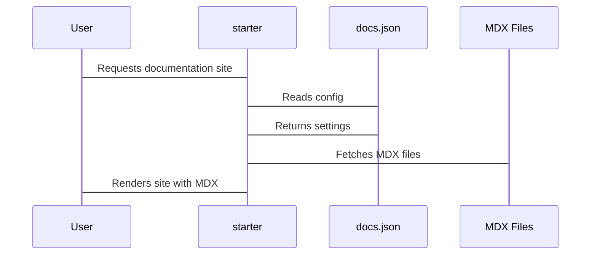

# Chapter 3: docs.json (Configuration File)

Welcome back! In the [previous chapter](02_navigation_configuration.md), we learned how to structure your documentation site's navigation using tabs, groups, and pages. But how does `starter` know *where* to find these pages, what colors to use, and what the overall look and feel of your documentation should be? That's where the **`docs.json` file** comes in!

Think of `docs.json` as the central control panel for your entire documentation site.  It's like the table of contents of a book, defining the structure and appearance of *everything*.  It specifies the navigation menu, the site's theme and colors, the logo, and other global settings. If your documentation site were a car, `docs.json` would be the dashboard with all the controls.

**A Central Use Case: Customizing Your Documentation's Look and Feel**

Let's say you want to change the main color of your documentation site from the default green to a cool blue. You also want to add your company logo.  How do you do it? You edit the `docs.json` file! That's what makes `docs.json` so important - almost everything you want to control, you can configure here.

**Key Concepts**
Here are some key aspects configured when you modify `docs.json`:

1.  **Global Site Settings:** The name of your project. The title of the documentation website. These are global properties.

2.  **Look and Feel:** This deals with the styling of the documentation site. Theme colors, logo, and favicon are properties located here.

3.  **Navigation:** We covered this in the [previous chapter](02_navigation_configuration.md). This is where you define the structure of pages in the sidebar.

Let's explore key parts of the `docs.json` file and see how we can adapt it for our own custom use cases.

**The Structure of `docs.json`**

The `docs.json` file is written in JSON (JavaScript Object Notation), which is a simple and easy-to-read format.

Here's a simplified example:

```json
{
  "name": "My Awesome Project",
  "colors": {
    "primary": "#007BFF"
  },
  "navigation": {
    "tabs": [
      {
        "tab": "Docs",
        "groups": [
          {
            "group": "Getting Started",
            "pages": ["introduction"]
          }
        ]
      }
    ]
  }
}
```

**Explanation:**

*   The entire file is enclosed in curly braces `{}`. This is valid JSON structure.
*   `"name"`: This is a string value that sets the project name which will be displayed in the header of the navigation.
*   `"colors"`: This is an *object* with properties for customizing the theme colors.
    *   `"primary"`: This is a string value that represents the primary color of your documentation site using a hexadecimal code (e.g., `#007BFF` for blue).
*   `"navigation"`: This is an object that defines the structure for the navigation, as seen in the [previous chapter](02_navigation_configuration.md).
    *   `"tabs"`: This is an array of tabs.
        *   `"tab"`: Sets the tab name in the top level navigation.
        *   `"groups"`: Within each tab you can enumerate groups that house
            *   `"group"`: Sets the group name in the sidebar navigation.
            *   `"pages"`: An array of page names, where each item is the name of the MDX file, such as `introduction.mdx` becoming `introduction`.

**Changing the Theme Color**

Let's go back to our initial use case: changing the primary color of your documentation site.

1.  **Open `docs.json`:** Find the `docs.json` file in the root directory of your `starter` project and open it in your favorite text editor.

2.  **Locate the `"colors"` section:** Find the section that starts with `"colors": {`.

3.  **Modify the `"primary"` color:** Change the value of the `"primary"` property to your desired hexadecimal color code. For example, to change it to a shade of green, you would use `#28A745`.

```json
{
  "name": "My Awesome Project",
  "colors": {
    "primary": "#28A745"
  },
  "navigation": {
    "tabs": [
      {
        "tab": "Docs",
        "groups": [
          {
            "group": "Getting Started",
            "pages": ["introduction"]
          }
        ]
      }
    ]
  }
}
```

After saving the changes to the `docs.json` file, refresh your documentation, and you should see the primary color updated to the new shade of green!

**Adding a Logo**
Next, let's add a logo to your documentation site.

1.  Suppose you have a logo image file named `logo.png` in the `/public/images` directory.

2.  Locate the `"logo"` section. If you don't have this key, you should add it.

3.  Modify the "logo" property to point to your image file. Here are some example customizations to configure a logo for both light and dark modes and set the link location to the root of the site.

```json
{
    "name": "My Awesome Project",
    "logo": {
        "light": "/images/logo.png",
        "dark": "/images/logo-dark.png",
	"href": "/"
    },
    "colors": {
        "primary": "#28A745"
    },
    "navigation": {
      "tabs": [
        {
          "tab": "Docs",
          "groups": [
            {
              "group": "Getting Started",
              "pages": ["introduction"]
            }
          ]
        }
      ]
    }
  }
```

**Explanation:**

*   The `"logo"` property is an object that can have `light` and `dark` properties, specifying different logos for light and dark themes.
*   The path to the image file is relative to the `/public` directory in your `starter` project.
*   `href`: Sets the website to redirect your user to when the logo is clicked. In this example, we route them to the root webpage `/`.

After running `starter` and refreshing the webpage, you should see the logo loaded in place of the "My Awesome Project" header!

**Adding Navigation**
We already covered the navigation properties in detail in [Chapter 2](02_navigation_configuration.md), but to reiterate, navigation tabs and groupings are defined primarily in this document. Here's a refresher on how to define groups and the structure of pages displayed in the sidebar.

```json
"navigation": {
    "tabs": [
      {
        "tab": "Docs",
        "groups": [
          {
            "group": "Getting Started",
            "pages": ["introduction"]
          }
        ]
      }
    ]
  }
```

**Explanation:**

*   The `"navigation"` property is an object that contains the configuration of site navigation.
*   `"tabs"`: The top-level tabs for site selection.
*   `"tab"`: Sets the name of the tab in the top navigation.
*   `"groups"`: Similar to tabs, this property houses groups
*   `"group"`: Sets the group name in the sidebar navigation.
*    `pages`: Sets an array of MDX pages to be rendered in each group.
    * *important:* The string should contain the *relative path* to the mdx files but *without* the extension. Example: if the path to the file is `src/docs/getting-started.mdx` then `"pages"` should be `src/docs/getting-started`.

**Internal Implementation**
`docs.json` is the central source of truth for your whole documentation site. How does `starter` utilize it?

When `starter` starts up, it reads the `docs.json` file into memory. It then uses this information to generate the overall appearance - theme colors, logo, and site name. Critically, the `navigation` field specifies the structure and hierarchy of all your documentation pages, building a navigation which connects each page to its corresponding component.

Here's a simplified sequence diagram that displays how `starter` uses `docs.json` when it is building your documentation site.



**Code Snippets from starter**
At a high level, `starter` reads in the configuration file and loads the metadata into memory. The `navigation.tabs` field reads the array of settings, passing each tab name to the `Tab` React component which dynamically renders the tab names in the top navigation. The `group` and `pages` properties load metadata which populate the sidebar with a list of navigation buttons that route to each MDX file.

```typescript
// getDocMeta.ts
import fs from 'fs';
import path from 'path';

export const getDocMeta = (docPath: string) => {
  const filePath = path.join(process.cwd(), docPath + '.mdx');
  try {
    const fileContent = fs.readFileSync(filePath, 'utf-8');
    // ... parsing logic to get title and description from frontmatter
    return { title, description }; // Simplified: returns the metadata
  } catch (error) {
    console.error(`Error reading or parsing ${filePath}:`, error);
    return { title: 'Error', description: '' };
  }
};
```

**Explanation:**

*   `getDocMeta.ts`: This file is used to extract header metadata from each MDX file.
*   This code reads the MDX in `docPath`. The code then extracts the headers, such as `title`, `description`, `icon`, etc. The value for these headers are set using frontmatter format in each `mdx` file.

```javascript
// Sidebar.tsx
import React from 'react';
import { getDocMeta } from './getDocMeta';

const Sidebar = ({ navigation }) => {
  return (
    <aside>
      {navigation.tabs.map((tab) => (
        <div key={tab.tab}>
          <h3>{tab.tab}</h3> { /* Renders Tab Titles */ }
          {tab.groups.map((group) => (
            <div key={group.group}>
              <h4>{group.group}</h4> { /* Renders Group Titles */}
              <ul>
                {group.pages.map((page) => {
                  const meta = getDocMeta(page);
                  return (
                    <li key={page}>
                      <a href={`/${page}`}>{meta.title}</a>
                    </li>
                  );
                })}
              </ul>
            </div>
          ))}
        </div>
      ))}
    </aside>
  );
};

export default Sidebar;
```

**Explanation:**

*   `Sidebar.tsx`: This React component, in tandem with the `getDocMeta` module, reads the `navigation` property in the `docs.json` file.
*   `{navigation.tabs.map((tab) =>` reads the top-level "tab" field and maps these names to a new navigation element.
*   `{group.pages.map((page) =>` reads the array of pages for each "group" field and generates new HTML list items for each.

**Conclusion**

In this chapter, you've learned the importance of the `docs.json` file, seeing it as the central control panel for your documentation site. You've walked through modifying theme colors, setting a logo, and defining navigation in `docs.json`. More importantly, you understand how `starter` uses `docs.json` during compilation.

In the [next chapter](04_mintlify_cli.md), you'll learn about the Mintlify CLI, a powerful tool that can help you manage your documentation project and automate tasks.


---

Generated by [AI Codebase Knowledge Builder](https://github.com/The-Pocket/Tutorial-Codebase-Knowledge)