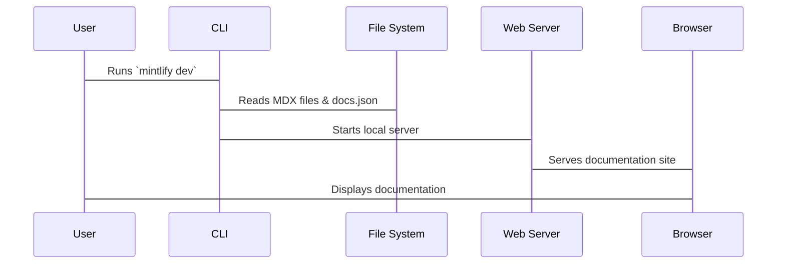

# Chapter 4: Mintlify CLI

Welcome back! In the [previous chapter](03_docs_json__configuration_file_.md), we learned how to configure our documentation site using the `docs.json` file, covering everything from the website name to the overall styling. Now, let's learn to preview the code, similar to a testing environment, before shipping your project for all users to see. This is where the **Mintlify CLI** comes in!

Think of the Mintlify CLI as your local helper for building awesome documentation. It's a toolkit you use from your computer's command line (or terminal) to help you develop and test your documentation *before* it goes live. It’s like having a personal assistant to run tests for you.

**Central Use Case: Previewing Your Documentation Locally**

Let's say you've made a bunch of changes to your documentation - new pages, edited descriptions, and tweaked the navigation in `docs.json`. You want to make sure everything looks perfect *before* you push those changes live for everyone to see. How do you do that without constantly deploying updates to a live server? The Mintlify CLI lets you preview the documentation site *locally* on your computer, so you can catch any errors or style issues ahead of time. This prevents broken links and errors from disrupting your user's experience.

**Key Concepts**

The Mintlify CLI has a few key powers that are useful for every documentation writer:

1.  **Local Development Server:** This lets you run a miniature version of your documentation site on your computer, so you can see your changes instantly.
2.  **Broken Link Checker:** This command makes sure that all the links in your documentation are working correctly.
3.  **Version Management:** Helps to keep your local CLI up-to-date so you can develop on the latest version of `starter`.

Let's look at each of these in detail.

**1. Local Development Server**

The most common use of the Mintlify CLI is starting a local development server. The command is:

```bash
mintlify dev
```

To run this command, open the command line, and navigate to the root directory of your `starter` documentation project. This is the folder that contains the `docs.json` file. Once you have navigated to the directory in your command line, copy and paste the `mintlify dev` command.

The CLI should start a local server, and you'll see a message in your terminal like:

```
Starting development server on http://localhost:3000
```

This means you can open your web browser and go to `http://localhost:3000` to see your documentation website! Any changes you make to your MDX files or `docs.json` will automatically reload in the browser, so you can see the updates in real time.

**Custom Ports**
Suppose port 3000 on your computer is already in use. To fix this issue, the CLI supports specifying a custom port with the following command:

```bash
mintlify dev --port 3333
```

In the browser, you will access the page using `http://localhost:3333`. With this command, you can specify whatever port you prefer.

**2. Checking for Broken Links**

Another common problem is broken links. Perhaps you made a navigation change and forgot where links route to. Run this command to find broken links in the documentation.

```bash
mintlify broken-links
```

Running it will scan all your MDX files and report any broken links. Links can be broken when the documentation is moved to new places. It's a good habit to run `mintlify broken-links` before you publish any changes. If your documentation site has a very large amount of links, link checking can take a while, so please be patient. When debugging links, make sure your server is running.

**3. Version Management**

It's important to have the latest and proper version running on your local machine, as well as on the cloud deployment. Older versions of `starter` might have subtle behaviors that cause unexpected errors. Run the following to make sure `starter` runs on the latest version.

First, check the version number using `mintlify -v`.

Then, if you want to update it, the command to install the latest version is:

```bash
npm i -g mintlify@latest
```

You can also use `yarn`.

```bash
yarn global upgrade mintlify
```

Make sure you have Node.js version 19 or later before proceeding.

**Internal Implementation**

So, what happens when you run these CLI commands? Let's take a peek under the hood. The CLI abstracts the complexities of web development, and bundles a large number of utilities such as a linter tool, a compiler, and a web server to handle the load of processing your documentation.

Here's a simplified look at how `mintlify dev` works:



Here's what happens when you run `mintlify broken-links`:

```mermaid
sequenceDiagram
    participant User
    participant CLI
    participant File System
    participant Link Checker
    User->CLI: Runs `mintlify broken-links`
    CLI->File System: Reads MDX files
    CLI->Link Checker: Extracts & validates Links
    Link Checker->CLI: Returns broken links
    CLI->User: Displays broken links
```

**Example Code Snippets:**

While we won't dive into the *exact* code that makes the CLI work (it's quite complex!), here's a simplified example of how the CLI might read your `docs.json` file using Javascript.

```javascript
const fs = require('fs'); // Node.js filesystem module

// Function to read the docs.json file
function readDocsConfig() {
  try {
    // Read the file synchronously
    const data = fs.readFileSync('docs.json', 'utf8');
    // Parse the JSON data into a JavaScript object
    const config = JSON.parse(data);
    return config;
  } catch (error) {
    console.error("Error reading or parsing docs.json:", error);
    return null;
  }
}

// Example usage:
const docsConfig = readDocsConfig();
if (docsConfig) {
  console.log("Project Name:", docsConfig.name);
  // Access other configuration properties as needed
}
```

**Explanation:**

*   This sample code reads the `docs.json` file and returns the documentation configuration as a JSON object. This JSON will then be used by `starter` to build the navigation, theme, and rendering.

**Troubleshooting:**

If you get an error, remove the currently installed version of Mintlify, upgrade it to Node v19 or higher, and try reinstalling Mintlify.

**Conclusion**

In this chapter, you've learned about the Mintlify CLI, a powerful tool that makes local documentation development easier. You've seen how to preview changes locally, check for broken links, and update to the latest version of `starter`.

In the [next chapter](05_snippets__reusable_mdx_components_.md), we'll explore Snippets. This will help you create reusable MDX components to streamline your documentation.


---

Generated by [AI Codebase Knowledge Builder](https://github.com/The-Pocket/Tutorial-Codebase-Knowledge)