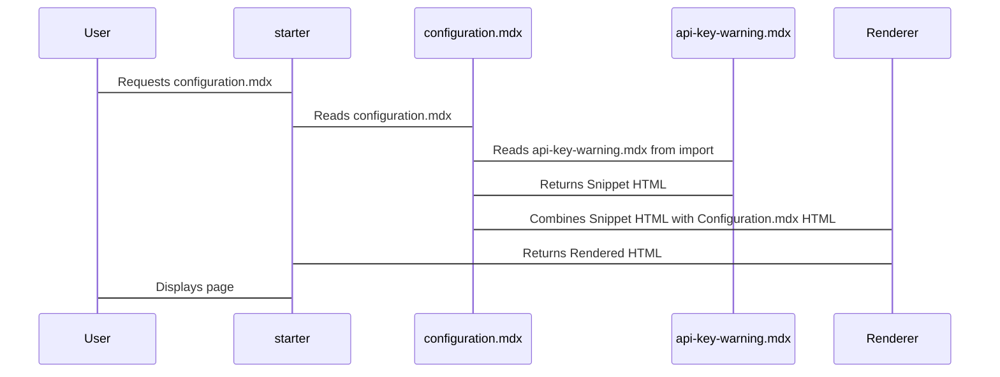

# Chapter 5: Snippets (Reusable MDX Components)

Welcome back! In the [previous chapter](04_mintlify_cli.md), we learned about the Mintlify CLI, and how it can help us preview and test our documentation. Now, imagine you have a standard warning message that you want to display on multiple pages. Instead of copy-pasting the same block of text repeatedly, wouldn't it be easier to write it once and then reuse it? That's exactly what **Snippets** (Reusable MDX Components) allow you to do!

Think of snippets like pre-written paragraphs or reusable code blocks that you can easily insert into different parts of your documentation. It's like having a library of common phrases that you can grab and use whenever needed. Imagine that you are a teacher giving multiple students a survey that includes instructions. It's easier to have the instructions copied beforehand and add on as needed, than to write them out one at a time.

**Central Use Case: Displaying a Common Warning Message**

Let's say you have a specific warning about API keys that needs to be displayed on several different documentation pages. With snippets, you can create this warning message once and then easily insert it into each relevant page.  If the warning ever needs to be updated, you only have to change it in one place, and the changes will automatically be reflected everywhere the snippet is used.

**Key Concepts**

Here are the key ideas behind using snippets:

1.  **Snippet Files:** These are MDX files that contain the reusable content.
2.  **Importing:**  You bring the snippet into a documentation page. It's just like copying only that block of code from the snippet to the documentation, but fully automated. Any time your documentation is updated, your documentation will automatically stay in sync.
3.  **Rendering:** The snippet's content is displayed as part of the documentation page.

Let's explore each of these in more detail.

**1. Creating a Snippet File**

First, you need to create an MDX file for your snippet. It's best practice to put all your snippets in a dedicated folder called `snippets` in the root directory of your project.

Let's create a file called `snippets/api-key-warning.mdx` with the following content:

```mdx
<Warning>
  Remember to keep your API key secret and never share it publicly!
</Warning>
```

**Explanation:**

*   This file creates what appears to be a simple custom HTML block element with warning text.
*   The `<Warning>` component (which would be defined elsewhere, potentially in a theme or layout file) provides a visually distinct style for this caution. Don't worry about this for now, it's just for demonstration. The essence is that this entire block is going to be reusable.

**Important:** Make sure to create the `snippets` directory if it doesn't already exist.

**2. Importing the Snippet**

Now, let's say you want to use this warning on your `configuration.mdx` page. You need to import the `api-key-warning.mdx` file into your documentation.

Open your `configuration.mdx` file and add the following line at the top:

```mdx
import ApiKeyWarning from '/snippets/api-key-warning.mdx';
```

**Explanation:**

*   `import ApiKeyWarning from '/snippets/api-key-warning.mdx';`: This line imports the content from the `api-key-warning.mdx` file and makes it available as a component called `ApiKeyWarning`. Think of `ApiKeyWarning` as "shorthand" for the entire block of MDX code living in `snippets/api-key-warning.mdx`.
*   When importing, you can name it whatever you want. For example, instead of labeling it `ApiKeyWarning`, it could hypothetically be called `BananaWarning`. `ApiKeyWarning` is easier to read though, because it describes what the snippet is!

**3. Rendering the Snippet**

Finally, you need to insert the snippet into your page. You do this by using the component name that you used in the `import` statement. Still in `configuration.mdx`, add the following anywhere you want the warning to appear, such as below the title:

```mdx
---
title: 'Configuration'
description: 'Learn how to configure your project.'
---

import ApiKeyWarning from '/snippets/api-key-warning.mdx';

# Configuration

<ApiKeyWarning />

This page explains how to configure your project.
```

**Explanation:**

*   `<ApiKeyWarning />`: This is how you "render" the snippet – it tells `starter` to insert the content of the `api-key-warning.mdx` file at that location. It's like saying, "Okay, insert that pre-written warning message right here!"
*   In the example code, we insert a React component block between the title and the description. This is also feasible in any other part of the document.

**Under the Hood: How Snippets Work**

So, what's happening when `starter` processes your MDX file with a snippet?

1.  **Parsing:** The MDX file is read and parsed. It identifies the `import` statement and the component usage (`<ApiKeyWarning />`).
2.  **Snippet Resolution:** `starter` finds the `api-key-warning.mdx` file based on the path specified in the `import` statement.
3.  **Substitution:** The content of the snippet file is substituted into the main MDX file at the location where the component is used.
4.  **Rendering:** The combined content is then rendered into HTML.

Here's a simplified sequence diagram:



**Example Code Snippets from starter**

The `starter` documentation shows examples of how snippets can be used for reusability. This keeps documentation DRY (Don't Repeat Yourself). Take a look at this example from within the `starter` documentation itself, showing how `snippet-intro.mdx` is used as a snippet in `/essentials/reusable-snippets.mdx`.

```mdx
---
title: Reusable Snippets
description: Reusable, custom snippets to keep content in sync
icon: 'recycle'
---

import SnippetIntro from '/snippets/snippet-intro.mdx';

<SnippetIntro />
```

The content contained in `snippet-intro.mdx` is:

```mdx
One of the core principles of software development is DRY (Don't Repeat
Yourself). This is a principle that apply to documentation as
well. If you find yourself repeating the same content in multiple places, you
should consider creating a custom snippet to keep your content in sync.
```

As you can see, the documentation `essentials/reusable-snippets.mdx` calls `snippet-intro.mdx` into the document.

**Working with Variables in Snippets**

Snippets become even more powerful when you add variables. This allows you to customize the snippet's content based on where it's being used.

Let's modify our `api-key-warning.mdx` file to include a variable:

```mdx
<Warning>
  Remember to keep your API key <code>{apiKeyName}</code> secret and never share it publicly!
</Warning>
```

**Explanation:**

*   `{apiKeyName}`: This is a variable that will be replaced with a value when you use the snippet.

Now, when you use the snippet, you need to provide a value for the `apiKeyName` variable:

```mdx
---
title: 'Configuration'
description: 'Learn how to configure your project.'
---

import ApiKeyWarning from '/snippets/api-key-warning.mdx';

# Configuration

<ApiKeyWarning apiKeyName="MY_API_KEY" />

This page explains how to configure your project.
```

**Explanation:**

*   `<ApiKeyWarning apiKeyName="MY_API_KEY" />`: This passes the value `"MY_API_KEY"` to the `apiKeyName` variable in the snippet. So, in the documentation, the rendered content will be:

```html
<Warning>
  Remember to keep your API key <code>MY_API_KEY</code> secret and never share it publicly!
</Warning>
```
With snippet variables, the same snippet can now be used in more places, preventing the need to create unique documents.

**Adding Custom Components to Snippets**

In addition to text and variables, you can also include React components in your snippets. This allows you to create more complex and interactive snippets. `starter` will automatically take care of all of the syntax for you as long as the component is imported correctly.

**Conclusion**

In this chapter, you've learned about snippets, a powerful way to reuse content in your documentation. You've seen how to create snippet files, import them into your documentation pages, render them, and work with variables. You've also seen how snippets can help to make your documentation more consistent and easier to maintain.

In the [next chapter](06_openapi_specification__openapi_json_.md), we'll explore OpenAPI specifications, a standard way to describe your APIs.


---

Generated by [AI Codebase Knowledge Builder](https://github.com/The-Pocket/Tutorial-Codebase-Knowledge)