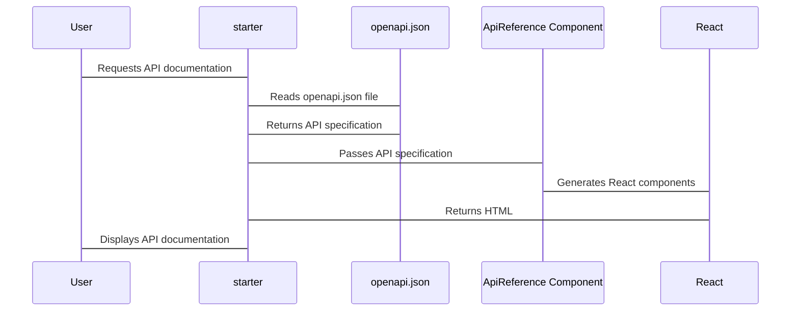

# Chapter 6: OpenAPI Specification (openapi.json)

Welcome back! In the [previous chapter](05_snippets__reusable_mdx_components_.md), we learned how snippets can help us write DRY documentation using reusable components. Now, let's say you want to automatically generate documentation for your API. Writing out all the details manually - the endpoints, the parameters, the responses - can be a huge pain. How do you solve this problem? This is where the **OpenAPI Specification** (specifically the `openapi.json` file) comes in!

Think of the `openapi.json` file as a contract between your API and anyone trying to use it. It's like architectural drawings for a building, describing all the available endpoints, their input parameters, and expected responses. Imagine you're a builder, and to build a house for your customer, you need to know all the dimensions, electrical layouts, etc.! The customer needs a consistent description of the house blueprint. This `openapi.json` file provides the customer and you will these details. Instead of manually explaining how the API works, you can simply point to this file.

**Central Use Case: Automatically Generating API Documentation**

Let's say you have an API with endpoints for managing users, products, and orders. Using an `openapi.json` file, you can automatically generate interactive API reference pages in your `starter` documentation. This provides a clear and concise overview of your API for developers, without you having to write all the documentation by hand! `starter` and other API documentation generators will automatically parse this JSON file to render a beautiful webpage describing usage of your API.

**Key Concepts**

Let's break down some key concepts in the `openapi.json` world:

1.  **Endpoints:** These are the specific URLs that your API exposes (e.g., `/users`, `/products`). Each URL defines one endpoint.
2.  **Parameters:** These are the inputs that your API expects. This can be query parameters at the end of the endpoint `?limit=10`, or it can be a JSON object containing data about your `user` object.
3.  **Responses:** These are the outputs that your API returns. This can describe what the output will look like, and whether the output will return a `200 OK` (meaning, successful!) or a `400` (meaning something went wrong!).
4.  **Schemas:** Schemas define the structure and data types of the request and response bodies. It's a formal definition of the parameter types.

Let's explore these concepts with an example.

**Example `openapi.json` Snippet**

Let's look at a small snippet from a `openapi.json` file:

```json
{
  "openapi": "3.1.0",
  "info": {
    "title": "My Awesome API",
    "version": "1.0.0"
  },
  "paths": {
    "/users": {
      "get": {
        "summary": "Get all users",
        "responses": {
          "200": {
            "description": "Successful operation",
            "content": {
              "application/json": {
                "schema": {
                  "type": "array",
                  "items": {
                    "type": "object",
                    "properties": {
                      "id": {
                        "type": "integer"
                      },
                      "name": {
                        "type": "string"
                      }
                    }
                  }
                }
              }
            }
          }
        }
      }
    }
  }
}
```

**Explanation:**

*   `"openapi": "3.1.0"`: This specifies the version of the OpenAPI specification being used.
*   `"info"`:  This section provides general information about the API, like the title and version.
*   `"paths"`: This is where the individual API endpoints are defined.
    *   `"/users"`: This defines an endpoint that handles requests to the `/users` URL.
        *   `"get"`: This specifies the HTTP method (GET) for this endpoint.
            *   `"summary"`: This provides a brief description of what the endpoint does.
            *   `"responses"`: This defines the possible responses from the endpoint.
                *   `"200"`: This describes the successful response (HTTP status code 200).
                    *   `"description"`: Describes what happens when this code is triggered.
                    *   `"content"`: Describes what the API endpoint will return.
                        * `"application/json"`: The endpoint will return something of the form JSON.
                        * `"schema"`: The content will have a schema of
                            *   ` type: "array"`: An array of
                            *   ` items`: objects that contain
                                * `"id"` of `type`: `integer` as well as
                                * `"name"` of `type`: `string`.

**Using the `openapi.json` File with `starter`**

How do you tell `starter` to use your `openapi.json` file to generate API documentation?

1.  **Place the file:** Put your `openapi.json` file in a convenient location within your `starter` project, such as the `api-reference` folder.
2.  **Configure navigation:** In your `docs.json` file, configure the navigation (as discussed in [Chapter 2: Navigation Configuration](02_navigation_configuration.md)) to point to a page that will render the API docs using the openapi spec. For example, create a page (`api-reference/introduction.mdx`) and use a specific component and tell it to reference the `openapi.json` file.

Here's how an `api-reference/introduction.mdx` might look:

```mdx
---
title: 'API Reference'
description: 'Our awesome API documentation.'
---

# API Reference

This page automatically generates API reference documentation from the `openapi.json` file.

<ApiReference spec="/api-reference/openapi.json" />
```

**Explanation:**

*   This tells `starter` to render the file located in `api-reference/openapi.json` using a specific `ApiReference` React component somewhere in the code. The `ApiReference` React component takes care of building the webpage out of this documentation.

Then, update your `docs.json` file to reference this documentation.

```json
{
  "name": "My Awesome Project",
  "navigation": {
    "tabs": [
      {
        "tab": "API",
        "groups": [
          {
            "group": "Overview",
            "pages": ["api-reference/introduction"]
          }
        ]
      }
    ]
  }
}
```

**Explanation:**

*   We are registering and including `api-reference/introduction` in the documentation by adding it to its entry as a `page` in the navigation.
*   Make sure that you save the changes and rerun `starter` after these edits.

**Internal Implementation**

How does `starter` actually use the `openapi.json` file behind the scenes?

1.  **Parsing:** `starter` reads and parses the `openapi.json` file, converting it into a data structure it can understand.
2.  **Component Mapping:** The `ApiReference` component takes this data structure and iterates through the endpoints, parameters, responses, and schemas. This translates this specification into visual React components.
3.  **Rendering:** Finally, React renders generates a webpage that showcases your API documentation.

Here's a simplified sequence diagram:



Let's look at some code snippets of what `starter` might do:

```javascript
// Simplified ApiReference component

import React, { useState, useEffect } from 'react';

function ApiReference({ spec }) {
  const [apiData, setApiData] = useState(null);

  useEffect(() => {
    async function loadApiData() {
      const response = await fetch(spec); // Get the openapi spec file
      const data = await response.json();
      setApiData(data); // save data to state
    }

    loadApiData();
  }, [spec]);

  if (!apiData) {
    return <div>Loading API documentation...</div>;
  }

  return (
    apiData.paths ? (<div>
        <h2>{apiData.info.title}</h2>
        {Object.entries(apiData.paths).map(([path, pathData]) => (
          	<div key={path}>
            	<h3>{path}</h3>
            	{Object.entries(pathData).map(([method, methodData]) => (
              	<div key={method}>
                	<h4>{method.toUpperCase()}</h4>
                    <p>{methodData.summary}</p>
              	</div>
            	))}
          	</div>
        ))}
      </div>)
      : <div>No API paths to render.</div>
  );
}

export default ApiReference;
```

**Explanation:**

*   This is a simplified `ApiReference` React component.
*   It uses `fetch` to read the `openapi.json` file, and store the JSON into the React state.
*   When `apiData` exists, it will iterate through all available API paths, and render it to the screen.
*   `{Object.entries(apiData.paths).map(([path, pathData]) =>` iterates through each path, with `path` listing the full endpoint, and `pathData` being an object that contains a description of the endpoint.
*   `{Object.entries(pathData).map(([method, methodData]) =>` iterates through requests such as `get`, `post`, `put`, etc. The endpoint description is rendered via `methodData.summary`.

**Conclusion**

In this chapter, you've learned what the `openapi.json` file is, and how it acts as a contract of how all your endpoints work. You've explored a concrete use case of using the `openapi.json` file to render an interactive API documentation page. You also learned about the various elements of documentation, from specifying the schema's API calls and the API returns. More importantly, you've understood the internal implementations of how `starter` compiles your `openapi.json` files into a website UI for your users.

Next, congratulations! You have reached the end of the tutorial. As you continue working with your API documentation setup, you can consult the [Mintlify documentation](https://www.mintlify.com/docs).


---

Generated by [AI Codebase Knowledge Builder](https://github.com/The-Pocket/Tutorial-Codebase-Knowledge)