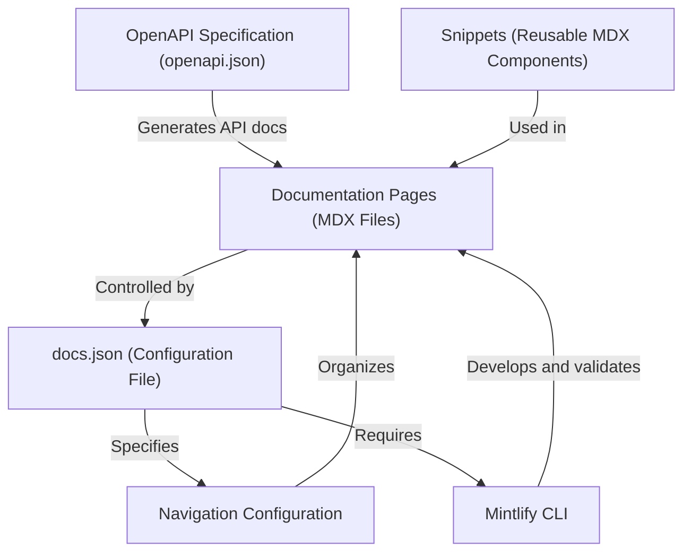

# Tutorial: starter

The Mintlify **Starter Kit** simplifies documentation. It uses *MDX files* for content, configured by `docs.json`, and can generate API references via `openapi.json`.
The Mintlify CLI aids local development, and reusable snippets promote consistency. The navigation is configured to create an intuitive user experience.

**Source Repository:** [https://github.com/mintlify/starter](https://github.com/mintlify/starter)

## Chapters

1. [Documentation Pages (MDX Files)](01_documentation_pages__mdx_files_.md)
2. [Navigation Configuration](02_navigation_configuration.md)
3. [docs.json (Configuration File)](03_docs_json__configuration_file_.md)
4. [Mintlify CLI](04_mintlify_cli.md)
5. [Snippets (Reusable MDX Components)](05_snippets__reusable_mdx_components_.md)
6. [OpenAPI Specification (openapi.json)](06_openapi_specification__openapi_json_.md)

---

Generated by [AI Codebase Knowledge Builder](https://github.com/The-Pocket/Tutorial-Codebase-Knowledge)